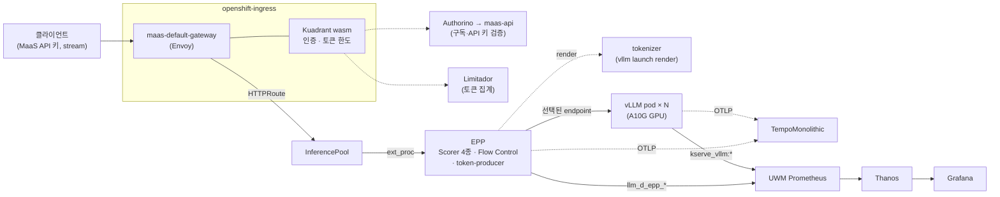

# openshift-ai-llmd-demo

OpenShift AI 3.5(RHOAI 3.5.1)에서 GA된 **llm-d 분산 추론 기능**을 **MaaS(Models-as-a-Service) 게이트웨이와
결합한 상태로** 시연·검증하는 시나리오 모음과 재현 하네스이다. 모든 시나리오는 실클러스터에서 측정하였으며,
측정 절차는 `harness/harness.sh` 명령으로 재현된다.

## 목적

1. **llm-d GA 기능의 실효 검증.** 우선순위 Flow Control, KV 캐시 인지 라우팅, 추론 인지 라이프사이클,
   멀티모달 라우팅, 분산 트레이싱, TLS 비활성화, Scorer 튜닝, 외부 토크나이저, Controlled Deployment의
   9개 기능이 실제 부하에서 어떤 효과를 내는지 정량화한다(시나리오 21~29).
2. **MaaS + llm-d 통합 경로의 검증.** 클라이언트 요청이 MaaS 인증·토큰 한도를 거쳐 EPP 스케줄링과 vLLM
   추론까지 이어지는 전체 경로에서 동작과 제약을 확인한다.
3. **재현성.** 각 측정은 하네스 명령 하나로 반복 가능하며, 종료 시 클러스터 설정을 원복한다.

## 아키텍처 (실측)

RHOAI 3.5.1에서 llm-d는 별도 설치 없이 KServe `LLMInferenceService`로 제공된다. 컨트롤러는
`redhat-ods-applications`의 preset(`LLMInferenceServiceConfig v3-5-1-kserve-config-llm-*`)을 병합하여
다음 리소스를 생성한다.

| `LLMInferenceService` 설정 | 생성 리소스 | 역할 |
|---|---|---|
| (기본) | `Deployment <name>-kserve`, `Service <name>-kserve-workload-svc` | vLLM 엔진 |
| `spec.router.gateway` / `route` | `HTTPRoute <name>-kserve-route` | Gateway 경로·모델 기반 라우팅 |
| `spec.router.scheduler` | `Deployment <name>-kserve-router-scheduler`(EPP), `InferencePool` | 요청별 endpoint 선택 |
| `spec.router.scheduler.config.inline` | EPP `--config-text` | Scorer, Flow Control, token-producer |
| `baseRefs: [llm-tokenizer preset]` | `Deployment <name>-tokenizer` | `vllm launch render` 외부 토크나이저 |
| `spec.tracing` | vLLM·EPP의 `OTEL_*` 환경변수 | OTLP 트레이스 |
| `spec.router.route.group` / `weight` | 모델 기반 라우팅 규칙의 backend weight | Controlled Deployment |

MaaS(RHOAI 3.5)는 DSC `spec.components.aigateway.modelsAsAService`로 활성화되며, `AITenant`, `maas-api`,
Kuadrant(Authorino·Limitador)로 구성된다. 모델은 `MaaSModelRef`, 접근·한도는 `MaaSSubscription`과
`MaaSAuthPolicy`로 관리한다.



**실측으로 확인한 제약** (상세: [lessonlearn.md](lessonlearn.md))

- **Gateway당 EPP 활성 모델 1개.** EPP 모델이 둘 이상이면 Envoy가 모든 InferencePool route의 ext_proc을
  마지막 EPP로 배정한다(503 또는 스케줄링 누락).
- **MaaS non-streaming 응답의 30~40%가 빈 본문**(HTTP 200, 0바이트)으로 반환된다(Kuadrant wasm-shim).
  클라이언트는 `stream: true`를 사용한다. 토큰 한도는 두 방식 모두 적용된다.
- **MaaS 인증 호출 타임아웃은 200ms**(`failureMode: deny`)이며 control plane 부하 시 0.1~0.4%의 500이 발생한다.
- **EPP 인라인 설정은 전체 교체한다.** merge 패치는 이전 키를 남겨 CrashLoop를 유발하고, 설정 제거는
  기본값으로 복귀시키지 않는다.
- **롤링 재기동에는 여유 GPU 1장이 필요하다**(maxSurge 1, maxUnavailable 0).
- **Authorino listener TLS는 켜야 한다.** odh-model-controller의 `<gateway>-authn-ssl` EnvoyFilter가 TLS로
  접속하므로, TLS off이면 인증이 필요한 모든 MaaS 요청이 500을 반환한다(`maas.sh`에 반영).

## 시나리오

- **11 (데이터 병렬화)**: RHOAI 3.5.1, `llmd-test`(Qwen2.5-1.5B-Instruct), g5.24xlarge(A10G), MaaS Gateway 경유.
- **12~16 (분산 운영)**: 최초 측정은 RHOAI 3.4.4, Qwen2.5-7B-Instruct, g5.2xlarge(A10G). RHOAI 3.5.1에서는
  EPP 없이 배포하여 워크로드 Service를 직접 호출하며, `llmd-test`와 같은 Gateway에 공존한다.
- **21~29 (llm-d GA 기능)**: RHOAI 3.5.1, Qwen2.5-1.5B-Instruct(24번은 Qwen2.5-VL-3B-Instruct), g4dn.xlarge(T4) × 2,
  MaaS Gateway 경유로 측정. 개요와 공통 전제: [llmd-ga-overview.md](docs/scenarios/llmd-ga-overview.md).

| # | 기능 | 검증 내용 | 실측 결과 | 하네스 명령 |
|---|---|---|---|---|
| 11 | [데이터 병렬화와 캐시 인지 라우팅](docs/scenarios/11-data-parallelism.md) | replica 1 vs 2, 분배 방식(`Service`/EPP/session affinity)별 처리량·캐시 적중률 | replica 2에서 EPP 분배는 처리량 ×1.99·적중률 66.7%(이론 상한), `Service` 분배는 ×1.55·41.2%. session affinity는 평상시 이득 없으나 EPP 재시작 시 적중률 94.2% 유지(기본 72.3%) | `scenario11-llmd-dp-affinity` |
| 12 | [장애 및 복구](docs/scenarios/12-failure-recovery.md) | 워크로드 pod 장애 시 실패율과 복구 시간 | 복구 384 s(모델 재다운로드 지배). 연결 실패는 서버 메트릭에 집계되지 않음 | `scenario12-llmd-failure-{start,trigger,stop}` |
| 13 | [요청 추적](docs/scenarios/13-request-tracing.md) | vLLM 인자 방식 OTLP 트레이싱 | 부분 실측(startup span). 요청 단위 trace는 시나리오 25(`spec.tracing`)에서 완료 | `scenario13-llmd-tracing-{demo,stop}` |
| 14 | [지연 진단](docs/scenarios/14-latency-diagnosis.md) | queue/prefill/decode 병목 구분 | decode가 단독 병목(9.6 s / 4.9 s), 재검증 시 재현 | `scenario14-llmd-latency-{start,diagnose,stop}` |
| 15 | [텐서 병렬화(TP)](docs/scenarios/15-tensor-parallelism.md) | 멀티 GPU 텐서 분할 서빙 | 계획(멀티 GPU 노드 필요) | 미구현 |
| 16 | [Expert 병렬화(EP)](docs/scenarios/16-expert-parallelism.md) | MoE expert 분산 | 계획(MoE 모델·멀티 GPU 필요) | 미구현 |
| 21 | [우선순위 Flow Control](docs/scenarios/21-flow-control-priority.md) | 포화 시 `InferenceObjective` 우선순위 적용 | 대화형 TTFT 1.7 s vs 대조군 24.3 s. `concurrency-detector` 필요(`utilization-detector`는 우선순위 역전) | `scenario21-llmd-flow-control` |
| 22 | [EPP Scorer 4종](docs/scenarios/22-epp-scorers.md) | KV 캐시 인지 라우팅 | prefix 적중률 83.2% vs 58.4%, TTFT p50 10배 단축, 처리량 2.1배 | `scenario22-llmd-epp-scorers` |
| 23 | [추론 인지 라이프사이클](docs/scenarios/23-inference-aware-lifecycle.md) | 롤링 업데이트 중 요청 유실 | pod 교체로 인한 유실 0건 | `scenario23-llmd-lifecycle` |
| 24 | [멀티모달 라우팅](docs/scenarios/24-multimodal-routing.md) | 동일 이미지 재요청의 캐시 pod 라우팅 | mm 캐시 적중률 76.1% vs 60.8%, TTFT p50 3.8배 단축 | `scenario24-llmd-vlm-{up,run,down}` |
| 25 | [E2E 분산 트레이싱](docs/scenarios/25-e2e-tracing.md) | `spec.tracing` 단일 trace | EPP 5 span + vLLM span 연결, queue/prefill/decode 분해 | `scenario25-llmd-tracing` |
| 26 | [TLS 비활성화](docs/scenarios/26-tls-disable.md) | DSC 전역 TLS off 효과 | 처리량 +3.5%, E2E p50 −2.4% | `scenario26-llmd-tls` |
| 27 | [Scorer 가중치 튜닝](docs/scenarios/27-scheduler-scorer-weights.md) | 캐시 우선 vs 부하 우선 정책 | hot-spot·포화 시 부하 우선 정책 TTFT 2.5배, 처리량 1.6배 | `scenario27-llmd-scorer-weights` |
| 28 | [외부 토크나이저](docs/scenarios/28-external-tokenizer.md) | 토크나이저 서비스 분리 | 독립 Deployment 동작. 텍스트 모델에서는 이득 없음(+36 ms) | `scenario28-llmd-tokenizer` |
| 29 | [Controlled Deployment](docs/scenarios/29-controlled-deployment.md) | route group 가중치 분할 | 90:10 → 92:8, 0:100 → 0:100. 다중 EPP 풀 제약으로 버전 내 스케줄링 미적용 | `scenario29-llmd-canary-{up,shift,down}` |

관측성 테스트케이스 [TC-01~05](docs/test-cases.md)(메트릭 수집·대시보드·알림)는 `./harness.sh llmd-monitoring`으로 구성한다.

## 사전 조건

- OpenShift 4.22, RHOAI 3.5.1(`DataScienceCluster` Ready, KServe Managed), NVIDIA GPU Operator
- GPU 노드: 현재 구성은 g5.24xlarge(A10G 24GB × 4). 21~28은 `llmd-test` replica 2, 29는 v1/v2로 GPU 2장을
  사용하며, 롤링 재기동 시나리오(23·25·26)는 여유 GPU 1장을 추가로 요구한다
- `oc login`(cluster-admin). bastion은 선택 사항이다(`HARNESS_EXEC=auto`는 로컬 `oc` 세션을 사용)
- 클러스터 접속 정보는 `AGENT.md`(gitignore)에 둔다: `cp AGENT.md.example AGENT.md`

```sh
oc get datasciencecluster default-dsc -o jsonpath='{.status.conditions[?(@.type=="Ready")].status}'
oc get crd llminferenceservices.serving.kserve.io inferenceobjectives.llm-d.ai
oc get nodes -l nvidia.com/gpu.present=true
```

## 재현 방법 (에이전트/사람 공용 실행 절차)

아래 명령은 `harness/` 디렉터리에서 실행한다.

1. **선행 조건 준비** — UWM, Grafana, CRD·Gateway 점검, 여유 GPU 보고
   ```sh
   ./harness.sh llmd-prereq
   ```
2. **MaaS 활성화** — RHOAI 버전을 판별하여 3.5+ 경로(`aigateway.modelsAsAService`)를 적용
   ```sh
   ./harness.sh maas
   oc get aitenant -A; oc get gateway -n openshift-ingress
   ```
3. **데모 모델 배포와 MaaS 등록** — EPP 기본 활성
   ```sh
   ./harness.sh llmd-test-up                 # manifests/llmd-test-llminferenceservice.json
   LLMD_NAMESPACE=llmd-test LLMD_NAME=llmd-test MAAS_USERS=<user>,system:serviceaccount:llmd-bench:loadgen \
     ./harness.sh maas-register-model
   ./harness.sh maas-api-key                  # sk-oai-* 키 → Secret llmd-bench/loadgen-token
   oc get llminferenceservice,inferencepool -n llmd-test
   ```
4. **관측 구성** — PrometheusRule, Grafana 대시보드, 트레이싱
   ```sh
   LLMD_NAMESPACE=llmd-test ./harness.sh llmd-monitoring
   ./harness.sh tracing
   ```
5. **시나리오 실행** — 21~28은 `llmd-test`로 실행하고, 24·29는 모델을 교체하여 마지막에 실행한다.
   ```sh
   ./harness.sh scenario22-llmd-epp-scorers                     # 예시. S22_* 로 규모 조정
   ./harness.sh llmd-test-down && ./harness.sh scenario29-llmd-canary-up
   ./harness.sh scenario29-llmd-canary-shift
   ./harness.sh scenario29-llmd-canary-down && ./harness.sh llmd-test-up
   ```
6. **MaaS 경로 점검**
   ```sh
   MAAS_CHECK=nonstream ./harness.sh maas-checks                # 빈 본문 발생률
   MAAS_CHECK=token-limit ./harness.sh maas-checks              # 토큰 한도 적용(원복 포함)
   ```

임의 부하와 지표 조회는 `./harness.sh llmd-loadgen`(스트리밍 TTFT/E2E, 클라이언트 측 코드 집계)과
`QUERY='<promql>' ./harness.sh llmd-promql`을 사용한다.

## UI로 보기

URL은 클러스터마다 다르며 `AGENT.md`에 기록한다.

- **Grafana** — `llm-d Observability` 대시보드(namespace 선택). `llmd-monitoring` 실행 후 표시된다.
  ```sh
  oc get route -n gpu-monitoring
  oc get secret gpu-grafana-admin-credentials -n gpu-monitoring -o jsonpath='{.data.GF_SECURITY_ADMIN_PASSWORD}' | base64 -d
  ```
- **Jaeger UI(Tempo)** — Tempo operator가 관리하는 Route. 시나리오 25의 trace ID로 조회한다.
  ```sh
  oc get route tempo-llmd-tracing-jaegerui -n openshift-tempo
  ```
- **MaaS 모델 목록** — API 키로 등록 모델을 확인한다.
  ```sh
  curl -sk https://maas.<apps-domain>/v1/models -H "Authorization: Bearer <sk-oai-...>"
  ```

## 디렉터리 구조

```
harness/
  harness.sh                  진입점 (llmd-prereq, maas*, llmd-*, tracing, scenario11-14, scenario21-29, maas-checks)
  config.env                  실행 위치(HARNESS_EXEC), bastion, 모델/GPU 기본값
  lib.sh                      실행 위치 판별, ssh_bastion/scp_to_bastion (local 모드는 로컬 실행)
  tools/loadgen.py            클러스터 내 부하 생성기 (스트리밍 TTFT/E2E, multi-prefix·image 모드)
  remote/lib/bench.sh         시나리오 공통 함수 (부하 Job, Thanos, pod 카운터, EPP 설정 교체, 사전 점검)
  remote/scenario2*.sh        시나리오 21~29 측정 스크립트
  remote/maas*.sh             MaaS 설치(3.5+/3.3-3.4), 모델 등록·해제, API 키, 점검
  remote/*.sh                 배포·관측·트레이싱·시나리오 11~14 스크립트
  remote/dashboards/          llmd-observability.json (Grafana)
docs/
  scenarios/                  21~29(llm-d GA, llmd-ga-overview.md), 11~16(분산 운영)
  test-cases.md               관측성 테스트케이스 TC-01~05
  test-results-2026-09-07.md  RHOAI 3.4.4 실측 결과
manifests/
  llmd-test-llminferenceservice.json   데모 모델 스펙 (llmd-test-up 에서 사용)
  prometheusrule-llmd-alerts.yaml      TTFT·에러율 알림 규칙
  servicemonitor-llmd.yaml             자동 생성 모니터 사본(참고)
  dsci-observability-patch.yaml        관측성 스택 패치 예시
grafana/llmd-dashboard.json   TTFT·처리량·에러율 대시보드
lessonlearn.md                발견 이슈와 교훈 (플랫폼 제약 포함)
AGENT.md.example              AGENT.md 템플릿 (AGENT.md는 gitignore)
```
