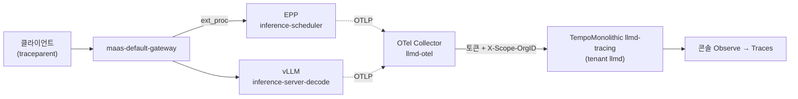

# 시나리오 13: 요청 추적 — 캐시 miss와 hit의 비교

**모듈:** 분산 환경 활용 > 관측성
**관련 컴포넌트:** `LLMInferenceService.spec.tracing`, EPP, vLLM, OpenTelemetry Collector, TempoMonolithic, 콘솔 Observe → Traces

## 목적

요청 하나가 EPP와 vLLM에서 어느 구간에 시간을 쓰는지 trace로 확인한다. 같은 대화의 1턴(새 문서, 캐시 miss)과
2턴(같은 문서 + 이력, 캐시 hit)을 비교하여, 시나리오 11의 캐시 효과를 요청 단위로 확인한다.

## 구성



| span (서비스) | 의미 |
|---|---|
| `gateway.request` (EPP) | EPP가 Gateway 요청을 받아 응답할 때까지 |
| `gateway.request_orchestration`, `run_scheduler_profile`, `filter_endpoints`, `pick_endpoints` (EPP) | pod 선택 과정. `candidate_endpoints`는 후보 pod 수 |
| `llm_request` (vLLM) | 추론 전체. `time_in_queue`, `time_in_model_prefill`, `time_in_model_decode`, `time_to_first_token` 속성 포함 |

## 절차

```sh
cd openshift-ai-llmd-demo/harness
./harness.sh tracing                    # Tempo(멀티테넌시), OTel Collector, 콘솔 Traces UI (1회)
./harness.sh scenario13-llmd-tracing    # 추적 켜기 + 대화 5개 × 2턴 + span 출력
```

조정 변수: `S13_CONVERSATIONS`(5), `S13_PREFIX_TOKENS`(3000). 추적은 켠 상태로 유지되며, 끄려면
`TRACING=off ./harness.sh llmd-tracing`을 실행한다. 콘솔에서는 Observe → Traces에서 `openshift-tempo/llmd-tracing`
(tenant `llmd`)을 선택하고 출력된 trace ID로 조회한다.

## 실측 결과 (2026-09-29, RHOAI 3.5.1, Qwen2.5-1.5B-Instruct, A10G)

대화 5개, 문서 약 3,000토큰, 응답 32토큰, 동시 1(대기열 없음).

| vLLM `llm_request` 속성 | 1턴 (miss) | 2턴 (hit) |
|---|---|---|
| prefill | 약 0.173초 | 약 0.032초 (**−82%**) |
| TTFT | 약 0.184초 | 약 0.043초 (**−77%**) |
| queue | 0 | 0 |

- **캐시 적중은 prefill을 약 5분의 1로 줄인다.** 2턴은 문서 부분을 다시 계산하지 않고 새 질문만 처리한다.
- **EPP의 pod 선택은 1ms 미만이다.** 후보 2개에서 filter·pick이 즉시 끝난다.
- **EPP `gateway.request` 시작부터 스케줄링까지 약 225~600ms가 걸렸다.** prefill보다 긴 구간이며, 외부 토크나이저
  (`llmd-test`의 tokenizer preset) 호출 등 스케줄링 전 처리로 추정되나 원인은 확인하지 않았다.
- Gateway(Envoy)와 MaaS 인증 구간은 trace에 포함되지 않는다.
