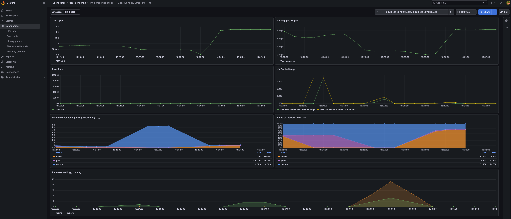
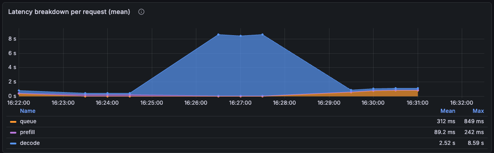
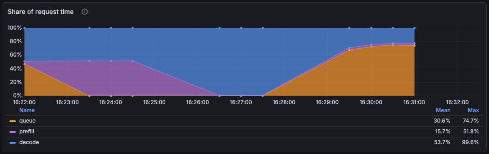
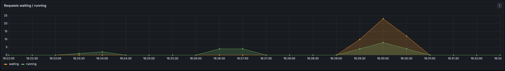
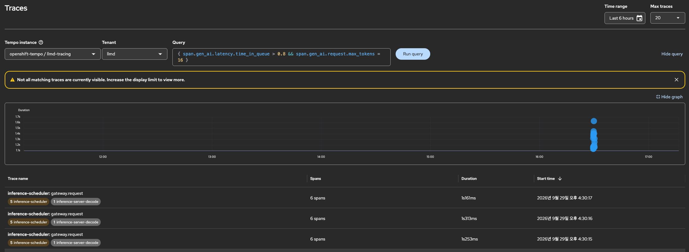
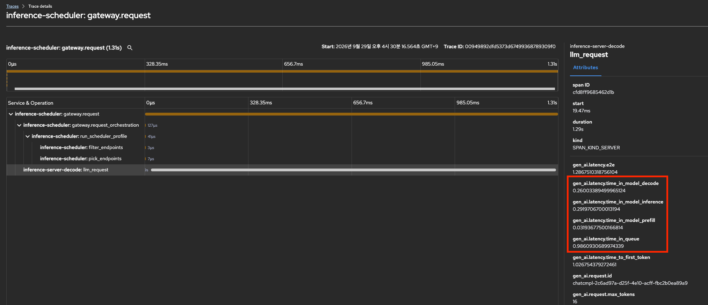
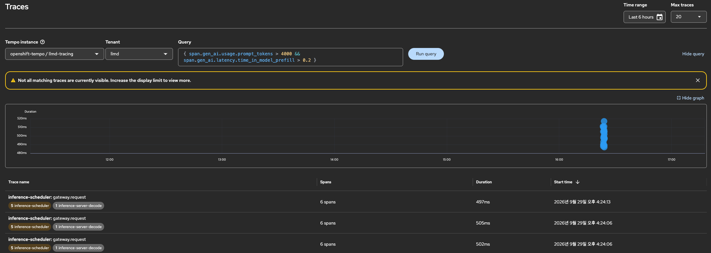
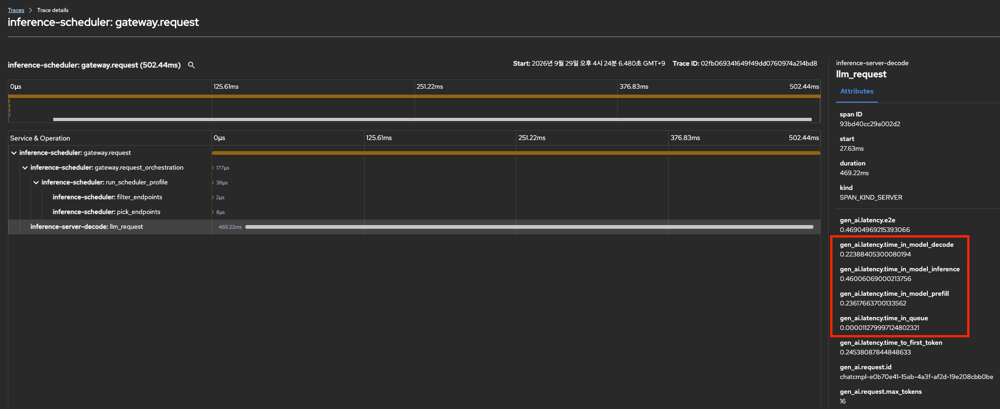
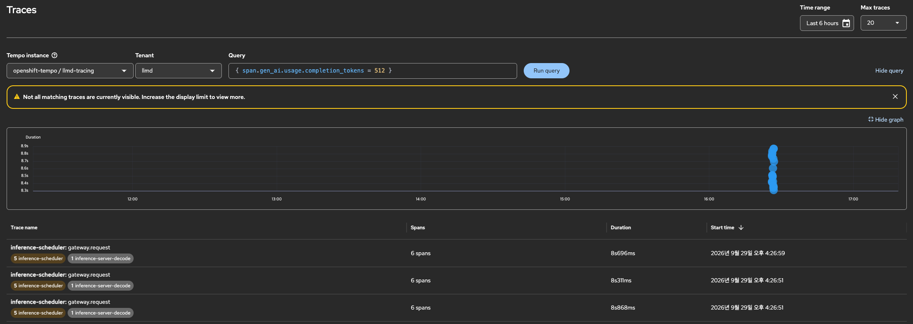
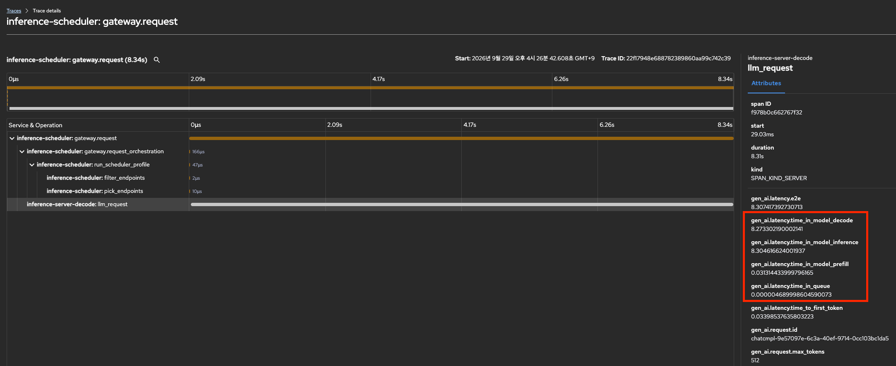

# 시나리오 14: 지연 진단

**모듈:** 분산 환경 활용 > 지연 진단
**관련 컴포넌트:** vLLM 지표 `kserve_vllm:request_{queue,prefill,decode}_time_seconds`, `time_to_first_token_seconds`,
`prefix_cache_{hits,queries}_total`, `kv_cache_usage_perc`

## 목적

"느리다"는 증상은 대기(queue), 프롬프트 처리(prefill), 토큰 생성(decode) 중 어디에서든 생길 수 있다. 병목을 하나씩
의도적으로 만든 부하 세 가지에 대해 vLLM 지표만으로 병목을 정확히 짚는지 검증하고, 판정 규칙을 정한다.

## 실험 설계

`llmd-test`(replica 2, `--max-num-seqs=4`), MaaS 경유, 부하별 60초.

| 부하 | 구성 | 의도한 병목 |
|---|---|---|
| W1 | 짧은 프롬프트, 응답 16토큰, 동시 32 (pod당 처리 슬롯 4의 8배) | queue |
| W2 | 매번 다른 약 5,000토큰 프롬프트, 응답 16토큰, 동시 2 | prefill (캐시 재사용 없음) |
| W3 | 짧은 프롬프트, 응답 512토큰 고정(`ignore_eos`), 동시 4 | decode |

W1은 "사람이 많아서", W2는 "질문이 길어서", W3는 "답이 길어서" 느린 상황을 재현한다. `llmd-test`의 처리 슬롯은
8개(pod 2 × 4)이므로 W1의 요청 32개는 대부분 줄을 서고, W2는 매번 처음 보는 긴 프롬프트를 캐시 없이 계산하며,
W3는 토큰 512개를 하나씩 순서대로 생성한다.

**판정 규칙.** 부하가 돈 구간만 집계한 평균(`_sum` / `_count`)으로 두 가지를 판정한다.

- TTFT 원인: queue와 prefill 중 큰 쪽
- 요청 전체 원인: queue, prefill, decode 중 가장 큰 쪽

vLLM 히스토그램의 첫 구간 경계가 0.3초여서, 0.3초 미만인 값의 p95는 모두 0.285초로 계산된다. 따라서 p95는 참고로만 쓴다.

## 절차

```sh
cd openshift-ai-llmd-demo/harness
./harness.sh scenario14-llmd-latency                     # W1~W3
S14_WORKLOADS="W2" S14_DURATION=90 ./harness.sh scenario14-llmd-latency
```

## 실측 결과 (2026-09-29, RHOAI 3.5.1, Qwen2.5-1.5B-Instruct, A10G, 추적 켬)

| 부하 | queue | prefill | decode | TTFT | 판정 (TTFT / 요청 전체) |
|---|---|---|---|---|---|
| W1 | **0.844초** | 0.033초 | 0.254초 | 0.862초 | queue 96% / **queue 75%** |
| W2 | 0.000초 | **0.242초** | 0.226초 | 0.251초 | prefill 100% / **prefill 52%** |
| W3 | 0.000초 | 0.033초 | **8.570초** | 0.047초 | prefill / **decode 99%** |

값은 평균이다. 캐시 적중률은 W1 77%, W2 0.4%, W3 81%이며, KV 캐시 최대 사용률은 1% 미만이다.

- 세 부하 모두 의도한 병목을 판정하였다.
- W2는 prefill과 decode의 차이가 작다(0.24초 대 0.23초). 두 단계 판정의 TTFT 쪽(prefill 100%)이 증상을 명확히 설명한다.
- 캐시 적중 시 prefill은 0.033초로, 시나리오 13의 trace 측정(0.032초)과 일치한다.

### 대시보드로 본 병목

Grafana `llm-d Observability` 대시보드(`./harness.sh llmd-monitoring`)의 지연 분해 패널로 세 부하를 한 화면에서 비교한다.
16:23~16:24는 W2, 16:25~16:27은 W3, 16:29~16:31은 W1 구간이다.



*그림 1. 대시보드 전체(namespace `llmd-test`, 16:22~16:32).*



*그림 2. Latency breakdown per request. W3 구간에서 decode(파랑)가 약 8.6초로 솟고, W1 구간에서 queue(주황)가 가장 두껍다.*



*그림 3. Share of request time. W2는 prefill(보라, 최대 52%), W3는 decode(파랑, 최대 99.6%), W1은 queue(주황, 최대 75%)가
면적 대부분을 차지한다.*



*그림 4. Requests waiting / running. W1 구간에서만 대기 요청(주황)이 최대 23건으로 급증하고, W2·W3는 대기가 없다.*

### trace로 본 병목

측정 중 추적(샘플링 100%)을 켜 두어, 요청마다 vLLM `llm_request` span이 Tempo에 남았다. vLLM은 queue·prefill·decode를
하위 span이 아닌 속성(`gen_ai.latency.time_in_queue`, `time_in_model_prefill`, `time_in_model_decode`)으로 기록하므로,
막대 길이가 아닌 span 속성에서 병목을 확인한다. 콘솔 Observe → Traces(`openshift-tempo/llmd-tracing`, tenant `llmd`)에서
다음 TraceQL로 부하별 trace를 찾는다.

| 부하 | TraceQL | 대표 trace | queue | prefill | decode |
|---|---|---|---|---|---|
| W1 | `{ span.gen_ai.latency.time_in_queue > 0.8 && span.gen_ai.request.max_tokens = 16 }` | `00949892…789309f0` (1.31초) | **0.986초** | 0.032초 | 0.260초 |
| W2 | `{ span.gen_ai.usage.prompt_tokens > 4000 && span.gen_ai.latency.time_in_model_prefill > 0.2 }` | `02fb0693…74a214bd8` (0.50초) | 0.000초 | **0.236초** | 0.224초 |
| W3 | `{ span.gen_ai.usage.completion_tokens = 512 }` | `22f17948…99c742c39` (8.34초) | 0.000초 | 0.031초 | **8.273초** |

**W1 — queue.** 요청 1.31초 중 0.99초가 처리 슬롯 대기이다. `llm_request` 막대에는 대기가 구분되지 않는다.




**W2 — prefill.** 약 5,000토큰 프롬프트의 prefill(0.236초)이 TTFT(0.245초)의 대부분이다.




**W3 — decode.** 512토큰 생성(8.27초)이 요청 전체(8.34초)를 차지한다.




*그림 5~7. 부하별 TraceQL 검색 결과와 trace 상세. 붉은 상자는 `llm_request` span의 지연 속성이다. EPP의 pod 선택 span은
세 경우 모두 수십 µs이다.*

## Summary: 진단 가이드

| 판정 | 의미 | 조치 |
|---|---|---|
| queue | 처리 슬롯 대기 | replica 증설(시나리오 11), `--max-num-seqs` 상향 |
| prefill | 프롬프트 처리 | prefix 재사용, 캐시 인지 분배(시나리오 11), 프롬프트 단축 |
| decode | 토큰 생성 | `max_tokens` 축소, replica 증설, 더 큰 GPU 또는 텐서 병렬화(시나리오 15) |

```sh
QUERY='sum(rate(kserve_vllm:request_queue_time_seconds_sum{namespace="<ns>"}[5m])) / sum(rate(kserve_vllm:request_queue_time_seconds_count{namespace="<ns>"}[5m]))' \
  ./harness.sh llmd-promql          # prefill, decode도 같은 형태로 평균을 구한다
```
