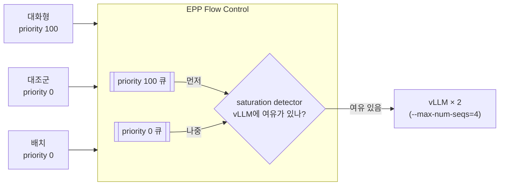
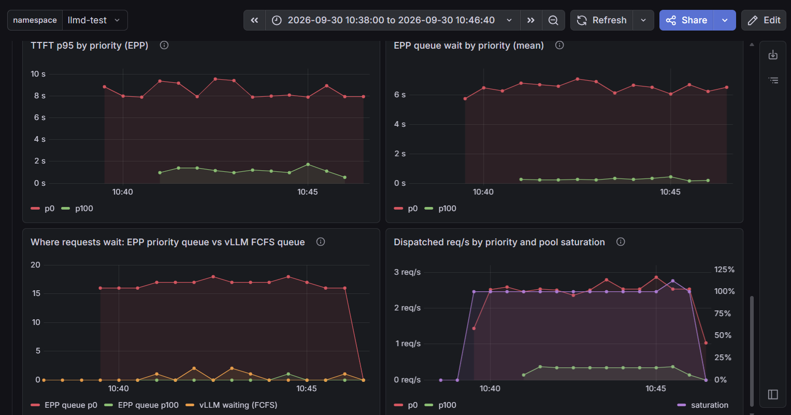
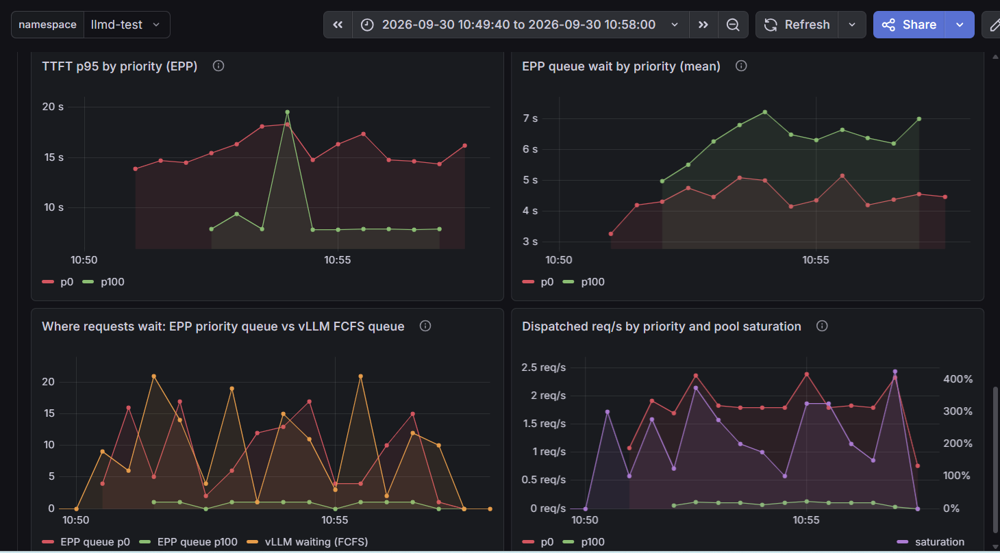

# 시나리오 21: 우선순위 기반 Flow Control

**모듈:** 서빙 및 추론 > 분산 추론 (GA)
**관련 컴포넌트:** EPP Flow Control, `InferenceObjective` (`llm-d.ai/v1alpha2`), MaaS Gateway

## 목적

풀이 포화된 상태에서 우선순위가 높은 요청이 먼저 처리되는지 검증한다.

## 구성



**saturation detector**는 vLLM에 요청을 더 보내도 되는지 판단한다. 여유가 없으면 요청을 EPP 큐에 붙잡아 두고,
여유가 생기면 우선순위가 높은 큐부터 꺼내 보낸다. 본 시나리오는 `concurrency-detector`(vLLM에 보낸 요청 수를
EPP가 직접 셈)를 사용한다.

| 트래픽 | priority | 요청 | 역할 |
|---|---|---|---|
| 배치 | 0 | 긴 프롬프트, 동시성 24 | 풀 포화 |
| 대화형 | 100 | 짧은 프롬프트, 2 s 간격 | 측정 대상 |
| 대조군 | 0 | 대화형과 동일 | 비교 기준 |

대조군은 대화형과 요청이 같고 우선순위만 다르다. 두 TTFT의 차이가 우선순위의 효과이다.

## 하네스 실행

```sh
./harness.sh scenario21-llmd-flow-control
```

## 절차

1) 우선순위를 정의한다. 요청 헤더 `x-llm-d-inference-objective`로 선택한다.

```sh
oc apply -n llmd-test -f - <<'YAML'
apiVersion: llm-d.ai/v1alpha2
kind: InferenceObjective
metadata:
  name: interactive
spec:
  priority: 100
  poolRef:
    name: llmd-test-inference-pool
---
apiVersion: llm-d.ai/v1alpha2
kind: InferenceObjective
metadata:
  name: batch
spec:
  priority: 0
  poolRef:
    name: llmd-test-inference-pool
YAML
```

2) Flow Control을 켠다. EPP 설정(`EndpointPickerConfig`)에 아래 항목을 추가한다.

```yaml
spec:
  router:
    scheduler:
      config:
        inline:
          apiVersion: llm-d.ai/v1alpha1
          kind: EndpointPickerConfig
          featureGates:
            - flowControl
          plugins:
            # (기본 plugins 유지)
            - type: concurrency-detector
              parameters:
                maxConcurrency: 4        # vLLM --max-num-seqs 와 동일
            - type: fcfs-ordering-policy
            - type: global-strict-fairness-policy
          flowControl:
            defaultRequestTTL: 300s
            saturationDetector:
              pluginRef: concurrency-detector
```

```sh
oc edit llminferenceservice llmd-test -n llmd-test
oc logs -n llmd-test deploy/llmd-test-kserve-router-scheduler | grep 'Flow Control layer'
```

3) 배치 부하 중에 대화형과 대조군을 동시에 보낸다.

```sh
./harness.sh llmd-loadgen   # HEADERS='{"x-llm-d-inference-objective":"batch"}' CONCURRENCY=24 PROMPT_MODE=unique-long
./harness.sh llmd-loadgen   # HEADERS='{"x-llm-d-inference-objective":"interactive"}' CONCURRENCY=1 INTERVAL=2
./harness.sh llmd-loadgen   # HEADERS='{"x-llm-d-inference-objective":"batch"}' CONCURRENCY=1 INTERVAL=2 (대조군)
```

## 판정 기준

| 지표 | 통과 조건 |
|---|---|
| TTFT | 대화형 < 대조군 |
| EPP 큐 대기 | priority 100 < priority 0 |

## 결과 (2026-09-30, Qwen2.5-1.5B-Instruct, A10G × 2)

**통과.** 우선순위 100 요청이 약 19배 빨리 첫 토큰을 받았다.

| 지표 | 대화형 (100) | 대조군 (0) |
|---|---|---|
| TTFT p50 | **0.37 s** | 6.91 s |
| TTFT p95 | **1.18 s** | 8.77 s |
| EPP 큐 대기 (평균) | **0.27 s** | 6.48 s |



*그림 1. Grafana `llm-d Observability` > `Flow Control / Priority`. priority 100(초록)의 TTFT와 큐 대기가
priority 0(빨강)보다 일관되게 낮다.*

### 참고: saturation detector에 따른 차이

`utilization-detector`로 바꾸면 우선순위가 적용되지 않는다(대화형 TTFT p50 6.85 s, 대조군 7.19 s). 요청이
EPP 큐가 아닌 vLLM 대기열에서 기다리게 되고, vLLM은 도착순으로 처리하기 때문이다.



*그림 2. utilization-detector. priority 100(초록)의 큐 대기가 priority 0보다 길다.*

| | `concurrency-detector` | `utilization-detector` |
|---|---|---|
| 요청이 기다리는 곳 | EPP 큐 (우선순위 순) | 주로 vLLM 대기열 (도착순) |
| 부하가 많을 때 | 우선순위 보장 | 우선순위 보장 안 됨 |

## 운영상 유의 사항

- 우선순위를 보장하려면 `concurrency-detector`를 사용하고 `maxConcurrency`를 vLLM `max-num-seqs`에 맞춘다.
- MaaS Gateway 경유 시 `x-llm-d-inference-objective` 헤더는 클라이언트가 지정한다.
