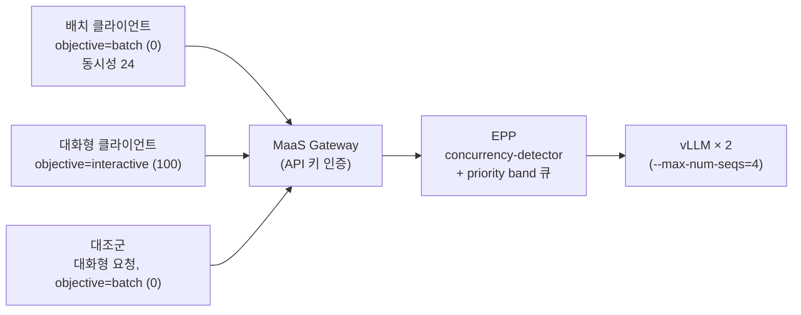

# 시나리오 21: 우선순위 기반 Flow Control

**모듈:** 서빙 및 추론 > 분산 추론 (GA)
**관련 컴포넌트:** EPP Flow Control, `InferenceObjective` (`llm-d.ai/v1alpha2`), saturation detector, MaaS Gateway

## 목적

풀이 포화 상태일 때 EPP가 `InferenceObjective.priority`에 따라 대화형(높은 우선순위) 요청을 배치(낮은
우선순위) 요청보다 먼저 처리하는지 검증한다. 판정 지표는 동일 시간대에 동시 실행한 두 트래픽 클래스의
TTFT와 EPP 큐 대기 시간이다.

## 구성



## 사전 조건

- EPP 활성 `LLMInferenceService`, MaaS 등록, API 키(`./harness.sh maas-api-key`)
- 포화 재현: vLLM `--max-num-seqs=4`

## 하네스 실행

```sh
./harness.sh scenario21-llmd-flow-control            # S21_DETECTOR=utilization 로 우선순위 역전 재현
```

수동 절차는 아래와 같으며, 하네스 명령은 동일 절차를 수행하고 설정을 원복한다.

## 절차

```sh
# 1) 우선순위 객체 (요청 헤더 x-llm-d-inference-objective 로 선택)
oc apply -n llmd-test -f - <<'YAML'
apiVersion: llm-d.ai/v1alpha2
kind: InferenceObjective
metadata: {name: interactive}
spec: {priority: 100, poolRef: {name: llmd-test-inference-pool}}
---
apiVersion: llm-d.ai/v1alpha2
kind: InferenceObjective
metadata: {name: batch}
spec: {priority: 0, poolRef: {name: llmd-test-inference-pool}}
YAML
oc get inferenceobjective -n llmd-test

# 2) Flow Control 활성화 (spec.router.scheduler.config.inline 에 추가)
#   featureGates: [flowControl]
#   plugins: [..., {type: concurrency-detector, parameters: {maxConcurrency: 4}}]
#   flowControl: {defaultRequestTTL: 300s, saturationDetector: {pluginRef: concurrency-detector}}
oc patch llminferenceservice llmd-test -n llmd-test --type=merge --patch-file flowcontrol.json
oc logs -n llmd-test deploy/llmd-test-kserve-router-scheduler | grep -E 'Flow Control layer|ConcurrencyDetector|priority band'

# 3) 배치 부하(420초) 시작 60초 후, 대화형·대조군 프로브를 동시에 300초 실행
./harness.sh llmd-loadgen   # HEADERS='{"x-llm-d-inference-objective":"batch"}' CONCURRENCY=24 PROMPT_MODE=unique-long ...
./harness.sh llmd-loadgen   # HEADERS='{"x-llm-d-inference-objective":"interactive"}' CONCURRENCY=1 INTERVAL=2
./harness.sh llmd-loadgen   # HEADERS='{"x-llm-d-inference-objective":"batch"}'       CONCURRENCY=1 INTERVAL=2 (대조군)
```

```promql
sum by (priority)(increase(llm_d_epp_flow_control_request_queue_duration_seconds_sum{namespace="llmd-test"}[8m]))
  / sum by (priority)(increase(llm_d_epp_flow_control_request_queue_duration_seconds_count{namespace="llmd-test"}[8m]))
max_over_time(sum(kserve_vllm:num_requests_waiting{namespace="llmd-test"})[8m:15s])
```

## 판정 기준

| 지표 | 통과 조건 |
|---|---|
| 대화형 TTFT (포화 중) | 대조군(동일 요청, 우선순위 0) 대비 유의하게 낮음 |
| EPP 큐 대기 | 우선순위 100 < 우선순위 0 |
| 우선순위 역전 | 없음 |

## 실측 결과 (2026-09-23, RHOAI 3.5.1, Qwen2.5-1.5B-Instruct, T4 × 2, MaaS Gateway 경유)

**통과(concurrency-detector 사용 시).** saturation detector 종류에 따라 결과가 정반대였다.

| 지표 | utilization-detector (queueDepth 2) | **concurrency-detector (maxConcurrency 4)** |
|---|---|---|
| 대화형 p100 TTFT p50 / p95 | 28.9 s / 37.3 s | **1.68 s / 3.72 s** |
| 대조군 p0 TTFT p50 / p95 | 31.7 s / 38.0 s | 24.3 s / 25.8 s |
| EPP 큐 평균 대기 p100 / p0 | 23.3 s / 17.2 s (역전) | **1.2 s / 21.4 s** |
| vLLM 대기열 최대 | 15 | 3 |
| 배치 처리량 | 0.51 req/s | 0.73 req/s |
| 배치 실패(500 / 연결 종료) | 13 / 4 | 2 / 0 |

**원인 분석.** `utilization-detector`는 vLLM 메트릭 폴링값(대기열 길이, KV 사용률)으로 포화를 판정한다.
메트릭이 갱신되기 전까지 EPP가 요청을 연속 디스패치하여 vLLM 내부 대기열이 임계값(2)을 크게 초과(15)하였다.
대기열이 우선순위 개념이 없는 vLLM 내부(FCFS)에 형성되었으므로 우선순위 100 요청도 동일하게 대기하였다.
`concurrency-detector`는 EPP가 디스패치한 요청 수를 직접 계수(open-loop)하므로 초과 유입이 없고,
대기열이 EPP의 priority band 큐에 형성되어 우선순위가 적용되었다.

## 운영상 유의 사항

- 우선순위 QoS가 목적이면 `concurrency-detector`를 사용하고, `maxConcurrency`를 vLLM `max-num-seqs`에 맞춘다.
- `saturationDetector`는 `flowControl.saturationDetector`에 둔다(최상위 필드는 deprecated).
- priority band는 `InferenceObjective` 생성 시 동적으로 추가된다(EPP 로그 `Dynamically added priority band`).
- MaaS Gateway AuthPolicy는 `x-llm-d-inference-objective` 헤더를 변경하지 않으므로 클라이언트가 지정한다.
  `openshift-ai-inference` Gateway의 AuthPolicy는 ServiceAccount 이름으로 objective를 주입한다(`overrides.objective`).
