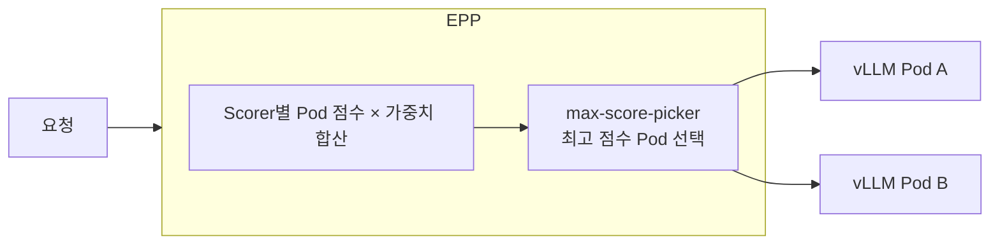
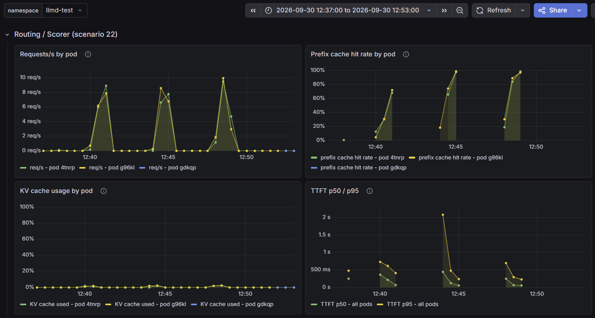
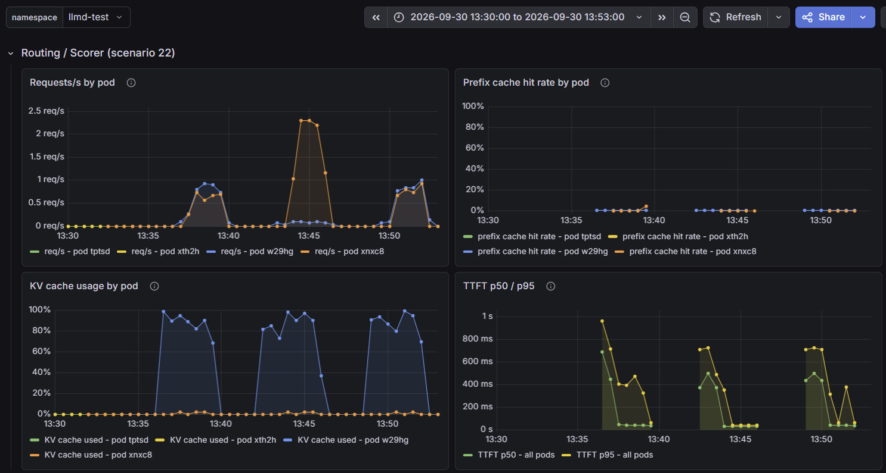
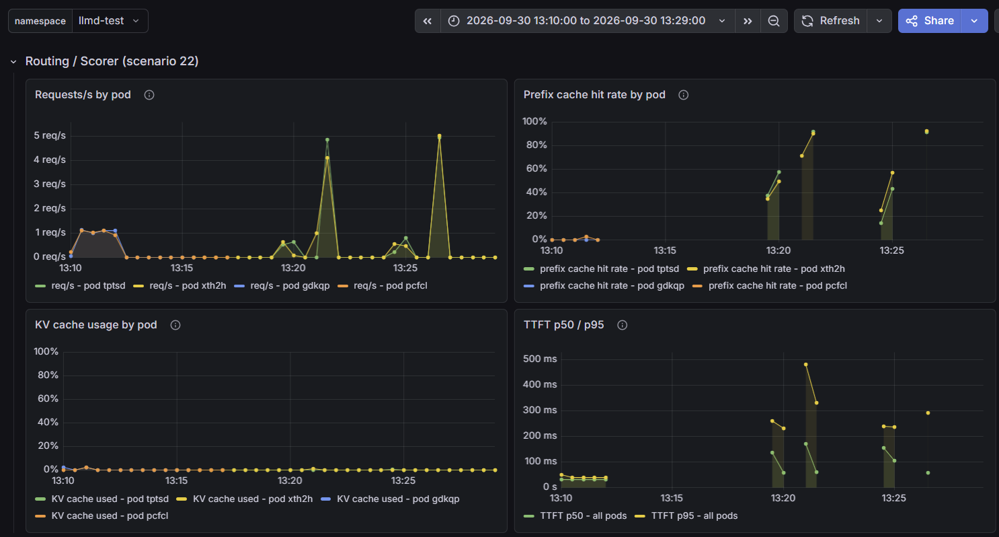

# 시나리오 22: EndpointPicker Scorer (KV 캐시 인지 라우팅)

**모듈:** 서빙 및 추론 > 분산 추론 (GA)
**관련 컴포넌트:** EPP, `prefix-cache-scorer`, `queue-scorer`, `kv-cache-utilization-scorer`, `no-hit-lru-scorer`

## 목적

EPP가 Scorer 점수로 요청을 알맞은 vLLM Pod에 보내는지, 그리고 기존 2종에 추가된
`kv-cache-utilization-scorer`, `no-hit-lru-scorer`가 각각 어떤 효과를 내는지 검증한다.

## 구성



| Scorer | 가중치 | 높은 점수를 주는 Pod | 효과 |
|---|---|---|---|
| `prefix-cache-scorer` (기존) | 3 | 요청 앞부분이 캐시된 Pod | 캐시 재사용, TTFT 단축 |
| `queue-scorer` (기존) | 2 | 대기열이 짧은 Pod | 부하 분산 |
| `kv-cache-utilization-scorer` (추가) | 2 | KV 캐시 여유가 큰 Pod | 메모리가 찬 Pod 회피 |
| `no-hit-lru-scorer` (추가) | 2 | 캐시 적중이 없는 요청일 때 가장 오래 안 쓴 Pod | 새 문서를 Pod에 고르게 배치 |

RHOAI 3.5.1의 기본 EPP 설정에 4종이 모두 포함되어 있다.

**prefix 캐시와 KV 캐시 사용률은 다르다.** prefix 캐시는 이전 요청의 KV를 재사용하려고 남겨 둔 것으로, 많을수록
좋다(`prefix-cache-scorer`). KV 캐시 사용률은 처리 중인 요청이 차지한 메모리로, 높을수록 새 요청이 들어갈 자리가
없다(`kv-cache-utilization-scorer`). 남겨 둔 prefix 캐시는 언제든 비울 수 있어 사용률에 포함되지 않는다.

**부하.** 부하 생성기가 만든 인공 문서(13개 단어를 무작위로 약 3,000개 나열, 약 5,400 토큰)에 짧은 질문을
붙여 보낸다. 같은 문서 번호는 같은 본문이므로, 반복 요청은 앞부분 KV 캐시를 재사용할 수 있다.

## 하네스 실행

```sh
./harness.sh scenario22-llmd-epp-scorers                 # 전체 (약 1시간)
S22_PARTS=abc ./harness.sh scenario22-llmd-epp-scorers   # 실험 1(abc) | 2(kv) | 3(lru) 중 선택
```

## 절차

1) EPP 설정을 바꿔 가며 같은 부하를 보낸다. 기본 4종 설정은 다음과 같다.

```yaml
spec:
  router:
    scheduler:
      config:
        inline:
          apiVersion: llm-d.ai/v1alpha1
          kind: EndpointPickerConfig
          plugins:
            - type: single-profile-handler
            - type: prefix-cache-scorer
            - type: queue-scorer
            - type: kv-cache-utilization-scorer
            - type: no-hit-lru-scorer
            - type: max-score-picker
            - type: metrics-data-source
              parameters:
                scheme: https
          schedulingProfiles:
            - name: default
              plugins:
                - pluginRef: prefix-cache-scorer
                  weight: 3
                - pluginRef: queue-scorer
                  weight: 2
                - pluginRef: kv-cache-utilization-scorer
                  weight: 2
                - pluginRef: no-hit-lru-scorer
                  weight: 2
                - pluginRef: max-score-picker
```

```sh
oc edit llminferenceservice llmd-test -n llmd-test
```

2) 실험별 비교 구성은 다음과 같다.

| 실험 | 구성 | Scorer | 부하 |
|---|---|---|---|
| 1. Scorer 구성 비교 | A | 없음 (`random-picker`, 무작위 선택) | 문서 150종 중 무작위 900건, 동시성 8 |
| | B | 기존 2종: prefix, queue | 〃 |
| | C | 4종 (기본) | 〃 |
| 2. KV 캐시가 찬 Pod 회피 | A | 기존 2종 | Pod A의 KV 캐시를 긴 요청으로 채운 상태에서 새 요청 전송 |
| | B | 기존 2종 + kv-cache-utilization | 〃 |
| | C | 4종 (기본) | 〃 |
| 3. 새 문서의 균등 배치 | A | 3종 (no-hit-lru 제외) | 새 문서 60종을 하나씩 전송 후 같은 문서 300건 재요청 |
| | B | 4종 (기본) | 〃 |

## 판정 기준

| 실험 | 통과 조건 |
|---|---|
| 1. Scorer 구성 비교 | Scorer 사용 시(B, C) random-picker(A)보다 prefix 캐시 적중률이 높고 TTFT가 짧음 |
| 2. KV 캐시가 찬 Pod 회피 | `kv-cache-utilization-scorer`가 있으면 새 요청이 KV 캐시가 찬 Pod를 피함 |
| 3. 새 문서의 균등 배치 | `no-hit-lru-scorer`가 있으면 새 문서가 두 Pod에 고르게 배치됨 |

## 결과 (2026-09-30, Qwen2.5-1.5B-Instruct, A10G × 2)

### 실험 1. Scorer 구성 비교

| 지표 | A. random-picker | B. 기존 2종 | C. 4종 (기본) | 설명 |
|---|---|---|---|---|
| prefix 캐시 적중률 | 67.9 % | **83.0 %** | **83.0 %** | 캐시에서 재사용한 토큰 비율 |
| TTFT p50 | 0.192 s | 0.099 s | 0.098 s | 첫 토큰까지 시간 |
| TTFT p95 | 0.526 s | 0.425 s | 0.357 s | |
| 처리량 | 14.7 req/s | 17.9 req/s | 18.2 req/s | |
| Pod 분포 | 449 : 451 | 431 : 469 | 459 : 441 | Pod A : Pod B 요청 수 |

- Scorer를 쓰면 같은 문서가 캐시를 가진 Pod로 가서 적중률이 15 %p 오르고 TTFT p50이 절반으로 줄었다.
- 기존 2종과 4종의 차이는 이 부하에서 거의 없다. 추가된 2종은 실험 2, 3의 조건에서 효과를 낸다.
- 실험 1의 KV 캐시 사용률은 두 Pod 모두 최대 약 2 %였다. KV 여유가 같으므로 `kv-cache-utilization-scorer`가
  두 Pod를 구분하지 못하였다.



*그림 1. 실험 1. 세 봉우리가 순서대로 A, B, C이다. B와 C는 prefix 캐시 적중률이 약 98 %까지 올라 A(약 70 %)보다
높고, 두 Pod의 요청 분포와 KV 사용률(약 2 %)은 세 구성에서 같다.*

### 실험 2. KV 캐시가 찬 Pod 회피 (kv-cache-utilization-scorer)

Pod당 KV 캐시를 16,384 토큰으로 줄이고(`--num-gpu-blocks-override=1024`), Pod A에 긴 요청 3개를 EPP를 거치지 않고
직접 보내 KV 사용률을 85~99 %로 유지하였다. 이 상태에서 새 요청을 EPP로 120초간 보냈다.

| 구성 | Pod A(가득) : Pod B(여유) | Pod A 비율 | 처리 건수 | TTFT p50 / p95 |
|---|---|---|---|---|
| A. 기존 2종 | 97 : 88 | 52 % | 185 | 0.072 s / 0.090 s |
| **B. 2종 + kv-cache-utilization** | **0 : 270** | **0 %** | **270** | **0.064 s / 0.071 s** |
| C. 4종 (기본) | 95 : 94 | 50 % | 189 | 0.071 s / 0.089 s |

- `kv-cache-utilization-scorer`를 추가하면 새 요청이 가득 찬 Pod A를 완전히 피했고, 처리 건수가 46 % 늘었다.
- 기본 4종(C)에서는 다시 50 : 50이 되었다. 새 요청에 대해 같은 가중치(2)의 `no-hit-lru-scorer`가 두 Pod를
  번갈아 선택하여 KV 회피 효과를 상쇄하였다. KV 회피가 중요하면 `kv-cache-utilization-scorer`의 가중치를 높인다.



*그림 2. 실험 2. 세 구간 모두 Pod A(`w29hg`, 파랑)의 KV 사용률이 80~99 %이다. 가운데 구간(B)에서만 새 요청이
Pod B(`xnxc8`, 주황)로 몰린다(약 2.3 req/s). 이때 Pod A의 약 0.1 req/s는 KV를 채우는 긴 요청의 완료분이다.*

### 실험 3. 새 문서의 균등 배치 (no-hit-lru-scorer)

| 구성 | 새 문서 배치 (Pod A : B) | 재요청 분포 | 재요청 적중률 |
|---|---|---|---|
| A. 3종 (lru 제외) | 35 : 25 | 146 : 154 | 90.9 % |
| **B. 4종 (기본)** | **30 : 30** | 149 : 151 | 91.9 % |

- `no-hit-lru-scorer`가 있으면 새 문서가 두 Pod에 정확히 절반씩 배치되었다.
- 재요청 성능 차이는 작다. Pod가 2개이고 KV 캐시 여유가 커서 약간의 쏠림이 손해로 이어지지 않았다.
  Pod 수가 많거나 캐시가 부족할수록 배치 균형의 효과가 커진다.
- 새 문서 단계의 prefix 캐시 적중률이 38~43 %로 측정되었으며 원인은 확인하지 못하였다(배치 판정과는 무관).



*그림 3. 실험 3. 13:19~13:22가 A(lru 제외), 13:24~13:27이 B(4종)이며, 각각 작은 봉우리가 새 문서 단계,
큰 봉우리가 재요청 단계이다. 13:10~13:12는 이전 실행의 잔여 구간이다. 배치 차이(35 : 25 대 30 : 30)는
그래프보다 표의 누적 건수로 확인한다.*

## Grafana

`llm-d Observability` > `Routing / Scorer (scenario 22)` 행에서 Pod별로 비교한다(namespace `llmd-test`).

| 패널 | 보는 것 |
|---|---|
| `Requests/s by pod` | 두 Pod에 요청이 어떻게 나뉘는지 |
| `Prefix cache hit rate by pod` | 같은 문서가 캐시를 가진 Pod로 갔는지 |
| `KV cache usage by pod` | 실험 2에서 Pod A만 가득 차 있는지 |
| `TTFT p50 / p95` | 라우팅의 최종 효과 |

## 운영상 유의 사항

### 상황별 Scorer 설정

| 상황 | 권장 설정 | 근거 |
|---|---|---|
| 일반적인 혼합 부하 | 기본 4종 유지 | 실험 1 |
| 같은 문서·시스템 프롬프트·대화 이력이 반복됨 (RAG, 챗봇) | `prefix-cache-scorer` 가중치를 가장 높게 유지 | 실험 1: 적중률 +15 %p, TTFT 절반 |
| 긴 컨텍스트, 요청 길이 편차가 큼, KV 캐시가 부족함 (큰 모델, 작은 GPU) | `kv-cache-utilization-scorer` 가중치를 `no-hit-lru-scorer`보다 높게 (예: 3 대 1) | 실험 2: 같은 가중치에서는 KV 회피 효과가 상쇄됨 |
| 새 문서가 계속 유입되고 Pod 수가 많음 | `no-hit-lru-scorer` 유지 | 실험 3: 새 문서가 균등 배치됨. Pod 2개에서는 성능 차이가 작았음 |
| 짧은 요청 위주로 캐시 재사용이 거의 없음 | `queue-scorer` 중심 | 추론(미측정) |
