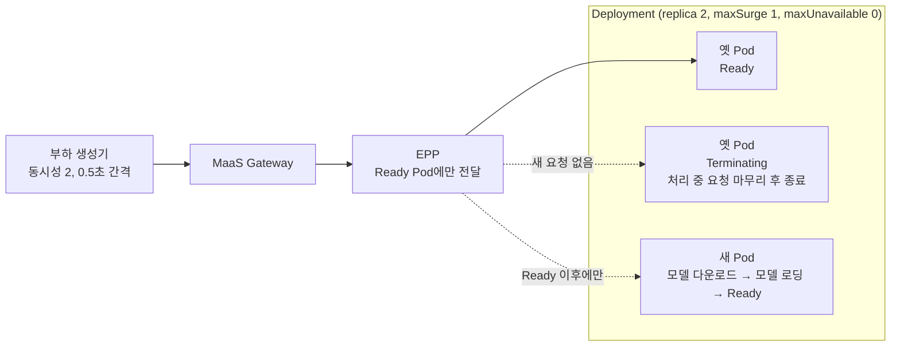
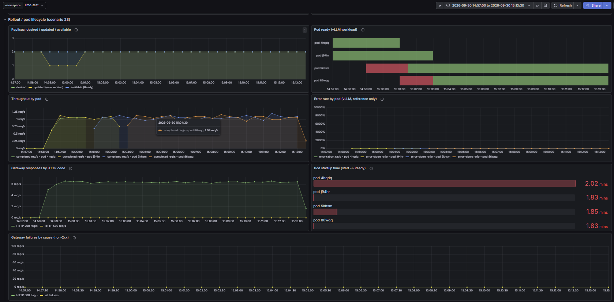
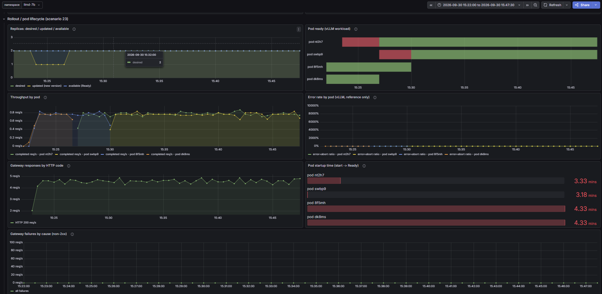

# 시나리오 23: 무중단 롤링 업데이트

**모듈:** 서빙 및 추론 > 분산 추론 (GA)
**관련 컴포넌트:** `LLMInferenceService` 컨트롤러, EPP, vLLM probe, `Deployment` rolling update

## 목적

트래픽을 받는 중에 모델 Pod를 교체해도 요청이 한 건도 실패하지 않음(무중단)을 검증한다.

## 구성



무중단은 다음 세 가지로 보장된다. 모두 컨트롤러가 워크로드 `Deployment`에 자동으로 설정한다.

1. 새 Pod는 모델 로딩이 끝나야 Ready가 되고(readinessProbe `/health`), EPP는 Ready Pod에만 요청을 보낸다.
2. 새 Pod가 Ready가 된 뒤에 옛 Pod를 하나 내린다(maxUnavailable 0). Ready Pod는 항상 2개이다.
3. 옛 Pod는 종료 전 15초 동안 처리 중인 요청을 마무리한다(preStop).

## 하네스 실행

```sh
./harness.sh scenario23-llmd-lifecycle                     # 부하 중 롤링 업데이트 유발, 구간별 실패 집계
```

## 판정 기준

| 지표 | 통과 조건 |
|---|---|
| 롤아웃 중 클라이언트 실패 | 0건 |
| Ready Pod 수 | 롤아웃 내내 2개 유지 |

## 결과 (2026-09-30, A10G, MaaS Gateway 경유)

**통과.** 두 모델 모두 롤아웃 중 실패 0건이며, TTFT도 변하지 않았다.

| 구간 | Qwen2.5-1.5B 요청 / 실패 | Qwen2.5-7B 요청 / 실패 |
|---|---|---|
| 롤아웃 전 | 76 / 0 | 54 / 0 |
| **롤아웃 중** | **478 / 0** (225 s) | **604 / 0** (394 s) |
| 롤아웃 후 | 1,362 / 0 | 1,642 / 0 |



*그림 1. Qwen2.5-1.5B (14:57~15:13).*



*그림 2. Qwen2.5-7B (15:22~15:47).*

- `Replicas`: `available`(Ready Pod 수)이 롤아웃 내내 2로 유지되었다.
- `Pod ready`: 새 Pod가 Ready(초록)가 된 뒤에 옛 Pod가 사라진다. 빨강은 모델을 로딩 중인 구간이다.
- `Throughput by pod`: 트래픽이 옛 Pod에서 새 Pod로 끊김 없이 넘어간다.
- `Gateway failures by cause`: 전 구간 0이다.
- `Pod startup time`: 새 Pod 준비 시간은 1.5B 약 1.8분, 7B 약 3.2분이었다. 모델이 클수록 롤아웃은
  길어지지만 무중단은 유지된다.

## 운영상 유의 사항

- maxSurge는 롤아웃 중 추가로 띄우는 Pod 수, maxUnavailable은 동시에 내릴 수 있는 Pod 수이다. 두 값은 Kubernetes
  `Deployment` 기본값 25 %이며, `LLMInferenceService`에는 이를 바꾸는 필드가 없다. 필요한 여유 GPU는 다음과 같다.

  ```
  maxSurge        = ⌈ replica × 25 % ⌉     (올림)
  maxUnavailable  = ⌊ replica × 25 % ⌋     (내림)
  필요한 여유 GPU  = maxSurge × Pod당 GPU 수
  ```

  | replica | maxSurge / maxUnavailable | Pod당 GPU | 필요한 여유 GPU |
  |---|---|---|---|
  | 2 (본 구성) | 1 / 0 | 1 | 1 |
  | 2 | 1 / 0 | 2 (tensor parallel 2) | 2 |
  | 4 | 1 / 1 | 1 | 1 |
  | 8 | 2 / 2 | 1 | 2 |
  | 8 | 2 / 2 | 4 (tensor parallel 4) | 8 |

  여유 GPU가 없으면 추가 Pod가 `Pending`에 머문다. maxUnavailable 0이면 롤아웃이 멈추고, 1 이상이면 옛 Pod를
  먼저 내려 진행하되 그동안 처리 용량이 줄어든다(미검증).
- 모델 로딩이 startupProbe 한도(10분)를 넘는 대형 모델은 `spec.template.containers[].startupProbe`를 늘린다.
