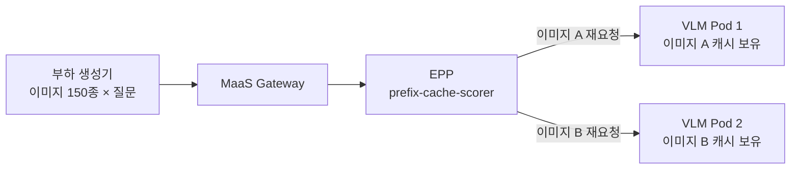
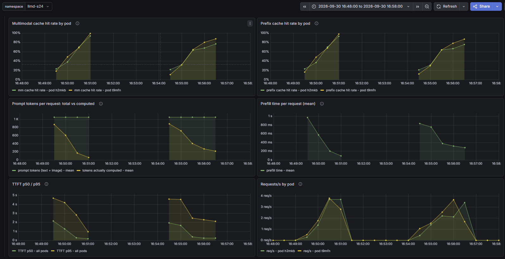
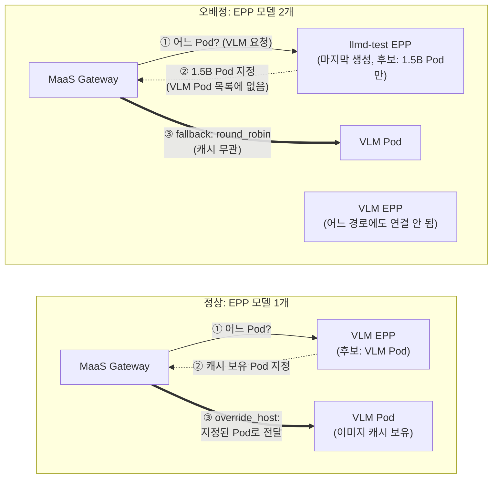

# 시나리오 24: 멀티모달 입력 라우팅

**모듈:** 서빙 및 추론 > 분산 추론 (GA)
**관련 컴포넌트:** EPP `prefix-cache-scorer`, VLM(vLLM), 멀티모달 캐시

## 목적

같은 이미지를 다시 요청하면 EPP가 그 이미지를 이미 처리한 Pod로 보내, 캐시를 재사용하여 TTFT를 줄이는지 검증한다.

## 구성

**VLM(Vision-Language Model)** 은 이미지와 텍스트를 함께 입력받는 모델이다. 비전 인코더가 이미지를 약 1,000개의
토큰으로 바꾼 뒤 언어 모델이 처리한다. 같은 이미지를 처리한 Pod에는 인코딩 결과(멀티모달 캐시)와 KV(prefix 캐시)가
남아 있어, 그 Pod로 보내면 두 단계를 건너뛴다.



**EPP가 Pod를 고르는 방법.** EPP(Endpoint Picker)는 요청마다 어느 vLLM Pod로 보낼지 정한다. RHOAI 3.5.1의 기본
설정(이하 **기본 EPP**)은 Scorer 4개가 Pod마다 점수를 매기고, 가중치를 곱한 합이 가장 높은 Pod를 고른다.

| Scorer | 가중치 | 점수를 높게 주는 Pod |
|---|---|---|
| `prefix-cache-scorer` | 3 | 같은 요청 앞부분을 전에 받은 Pod (캐시가 있을 가능성이 높음) |
| `queue-scorer` | 2 | 대기열이 짧은 Pod |
| `kv-cache-utilization-scorer` | 2 | KV 메모리 여유가 큰 Pod |
| `no-hit-lru-scorer` | 2 | 새 요청일 때 가장 오래 안 쓴 Pod |

캐시를 인지하는 것은 `prefix-cache-scorer`이다. EPP는 요청 본문을 블록 단위로 해시하여 어느 Pod로 보냈는지 기록하고,
앞부분 해시가 많이 일치하는 Pod에 높은 점수를 준다. 요청 본문에 이미지 URL이 문자열로 들어 있으므로 같은 이미지는 같은
해시가 되어 같은 Pod로 간다. 나머지 3개는 한 Pod에 요청이 몰리지 않도록 균형을 잡는다.

EPP는 Scorer가 점수를 매기고 picker가 Pod를 고르는 두 단계로 동작한다. 기본 EPP의 picker는 `max-score-picker`(최고 점수
선택)이다. 비교 대상 B는 Scorer를 모두 빼고 picker를 `random-picker`(무작위 선택)로 바꾼 EPP 설정이다. 요청 경로(Gateway →
EPP → Pod)는 같고 Pod를 고르는 방법만 다르므로, 두 결과의 차이가 캐시 인지 라우팅의 효과이다.

| 항목 | 값 |
|---|---|
| 모델 | `Qwen2.5-VL-3B-Instruct`, replica 2, namespace `llmd-s24` |
| 부하 | 이미지 150종(`picsum.photos`, 번호별 고정) × 무작위 질문, 600건(이미지당 약 4회), 동시성 8 |
| 비교 | A. 기본 EPP / B. `random-picker`(무작위 선택) |

이미지당 4회 요청 시 첫 요청만 캐시 miss이면 적중률의 이론 상한은 75 %이다.

**입력 이미지.** 요청에는 이미지 파일이 아니라 URL을 넣고, vLLM Pod가 요청마다 URL에서 이미지를 내려받는다.

| 항목 | 값 |
|---|---|
| URL | `https://picsum.photos/seed/llmd{n}/896/896` (예: [llmd1](https://picsum.photos/seed/llmd1/896/896)) |
| 출처 | picsum.photos 무료 샘플 사진. 같은 번호 `n`은 항상 같은 사진 |
| 크기 | 896 × 896, 이미지당 약 1,000 토큰 |
| 번호 | 측정마다 새 시작 번호 + 0~149 무작위. A와 B는 서로 다른 150장을 사용 |

요청 예시:

```json
{"model": "Qwen2.5-VL-3B-Instruct", "max_tokens": 16, "stream": true,
 "messages": [{"role": "user", "content": [
   {"type": "image_url", "image_url": {"url": "https://picsum.photos/seed/llmd123456/896/896"}},
   {"type": "text", "text": "What is the main topic?"}]}]}
```

## 하네스 실행

```sh
./harness.sh llmd-test-down && ./harness.sh scenario24-llmd-vlm-up   # VLM 배포 (Gateway당 EPP 모델 1개)
./harness.sh scenario24-llmd-vlm-run                                  # A/B 측정 후 EPP 원복
./harness.sh scenario24-llmd-vlm-down && ./harness.sh llmd-test-up
```

## 판정 기준

| 지표 | 통과 조건 |
|---|---|
| 멀티모달·prefix 캐시 적중률 | 기본 EPP > random-picker, 이론 상한(75 %)에 근접 |
| TTFT | 기본 EPP < random-picker |

## 결과 (2026-09-30, Qwen2.5-VL-3B-Instruct, A10G × 2, MaaS Gateway 경유)

**통과.** 기본 EPP의 적중률은 이론 상한과 같았고, TTFT p50은 3배 짧았다.

| 지표 | A. 기본 EPP | B. random-picker | 설명 |
|---|---|---|---|
| 멀티모달 캐시 적중률 | **76.5 %** | 62.1 % | 이미지 인코딩을 재사용한 비율 |
| prefix 캐시 적중률 | **75.8 %** | 61.5 % | 이미지 토큰을 포함한 앞부분을 재사용한 비율 |
| TTFT p50 / p95 | **0.26 s / 2.38 s** | 0.76 s / 2.89 s | 첫 토큰까지 시간 |
| 처리량 | **6.41 req/s** | 4.74 req/s | |
| 성공 / 전체 | 600 / 600 | 599 / 600 | B의 1건은 503 |
| Pod 분포 | 290 : 310 | 286 : 313 | 두 Pod 요청 수 |



*그림 1. Grafana `Multimodal (scenario 24)`. 왼쪽 구간(16:49~16:51)이 A. 기본 EPP, 오른쪽 구간(16:54~16:57)이 B. random-picker이다.*

**패널별 분석**

| 패널 | A. 기본 EPP | B. random-picker | 해석 |
|---|---|---|---|
| Multimodal cache hit rate by pod | 약 20 % → 95~100 % | 약 15 % → 77~87 % | 처음에는 모든 이미지가 새것이라 낮고, 재요청이 늘며 오른다. A는 재요청이 거의 모두 캐시를 가진 Pod로 가서 100 %에 가깝게 오른다. |
| Prefix cache hit rate by pod | 멀티모달과 같은 모양 | 멀티모달과 같은 모양 | 프롬프트의 대부분이 이미지 토큰이므로 두 캐시가 함께 움직인다. |
| Prompt tokens per request: total vs computed | 전체 약 1,050 토큰 중 계산량 880 → 60 | 계산량 890 → 220 | 두 선의 간격이 캐시로 건너뛴 토큰이다. 후반 A는 약 6 %만, B는 약 21 %를 계산하였다. |
| Prefill time per request | 0.97 s → 0.10 s | 0.85 s → 0.28 s | 계산량 감소가 그대로 prefill 시간 단축으로 이어진다. |
| TTFT p50 / p95 | p50 2.1 s → 0.2 s, p95 4.7 s → 1.0 s | p50 1.9 s → 0.3 s, p95 4.6 s → 2.1 s | 초반은 새 이미지 인코딩으로 느리고, 캐시가 채워지며 빨라진다. A는 p95까지 크게 낮아진다. |
| Requests/s by pod | 두 Pod 각 약 3.7 req/s, 약 1분 30초에 완료 | 두 Pod 각 약 3.6 req/s, 약 2분 30초에 완료 | 두 구성 모두 요청을 고르게 나누었다. A는 캐시를 재사용한 만큼 같은 600건을 더 빨리 끝냈다. |

## 운영 가이드

> **⚠️ 주의: MaaS Gateway 하나에 EPP 모델은 1개만 둔다.**
>
> EPP를 켠 모델이 2개 이상이면 Gateway가 모든 경로를 **마지막에 생성된 모델의 EPP**로 연결한다. 2026-09-30에 VLM과
> 텍스트 모델(`llmd-test`)을 함께 올려 재확인하였다(OCP 4.22.16, RHOAI 3.5.1).
>
> | 확인 항목 | 결과 |
> |---|---|
> | Gateway 설정(Envoy config dump) | VLM 경로를 포함한 64개 경로의 EPP 연결 대상이 모두 `llmd-test-epp-service` |
> | 실제 요청 | VLM 요청이 `llmd-test` EPP를 거침(EPP 로그·지표에 VLM 모델명 기록) |
> | 요청 도착 Pod | VLM 요청은 모두 VLM Pod가 처리. 1.5B Pod는 자기 요청 40건만 받음(VLM 모델명·404 없음) |
>
> 측정 결과 (VLM, 이미지 150종 × 600건, 동시성 8, MaaS Gateway 경유):
>
> | 지표 | EPP 모델 1개 (정상) | **EPP 모델 2개 (오배정)** | random-picker (기준) |
> |---|---|---|---|
> | 성공 / 전체 | 600 / 600 | **600 / 600** | 599 / 600 |
> | 멀티모달 캐시 적중률 | 76.5 % | **69.0 %** | 62.1 % |
> | prefix 캐시 적중률 | 75.8 % | **68.4 %** | 61.5 % |
> | TTFT p50 / p95 | 0.26 s / 2.38 s | **0.52 s / 2.40 s** | 0.76 s / 2.89 s |
> | 처리량 | 6.41 req/s | **5.61 req/s** | 4.74 req/s |
>
> VLM 경로의 목적지는 VLM Pod 목록(`llmd-vlm-inference-pool`)이고, Pod 선택은 EPP가 지정한 Pod로 보내는
> `override_host` 방식이다. 지정된 Pod가 목록에 없으면 대체(fallback) 방식인 `round_robin`으로 고른다(Envoy 설정에서 확인).
> 잘못된 EPP는 1.5B Pod만 알므로 그 선택은 VLM 목록에 없고, Gateway가 VLM Pod를 round-robin으로 직접 고른다.
> 2026-09-23에는 요청이 503으로 실패하였으나, 이번에는 **요청은 성공하고 캐시 인지 라우팅만 약해졌다.** 오류가 나지 않아
> 발견이 어렵다. 여러 모델을 MaaS로 서비스할 때는 캐시 인지 라우팅이 필요한 모델 1개에만 EPP를 켜고, Gateway
> 설정의 EPP 연결 대상을 확인한다.
>
> ```sh
> # 경로별 EPP 연결 대상. 모델마다 자기 EPP가 나와야 정상 (2026-09-30: 64건 모두 llmd-test-epp-service)
> GW=$(oc get pods -n openshift-ingress -o name | grep maas-default-gateway | head -1)
> oc exec -n openshift-ingress $GW -- pilot-agent request GET config_dump | grep -o '"cluster_name": *"outbound|9002||[^"]*' | sort | uniq -c
> ```

**구성 비교.** "정상"은 EPP 모델이 1개인 구성, "오배정"은 EPP 모델이 2개일 때 실제로 관찰된 연결이다.



| 구분 | 가이드 | 근거 |
|---|---|---|
| 라우팅 설정 | 기본 EPP를 그대로 사용한다. 별도 멀티모달 설정 없이 캐시 인지 라우팅이 동작한다. | 실측: 적중률 76.5 %(이론 상한 75 %) |
| 효과가 큰 워크로드 | 같은 이미지를 여러 번 참조하는 경우(한 이미지에 여러 질문, 문서·도면 Q&A, 멀티턴 대화) | 실측: 캐시 적중 시 계산 토큰 약 6 %, TTFT p50 1/3 |
| 이미지 식별 | 같은 이미지는 같은 URL로 보낸다. EPP는 URL 문자열로 같은 이미지를 판단하므로, 서명 토큰·쿼리 파라미터가 매번 바뀌는 URL은 캐시 효과가 없다. | 원리(미측정) |
| 이미지 전달 | URL 방식은 vLLM Pod의 외부 접근이 필요하고 다운로드 시간이 TTFT에 더해진다. 폐쇄망은 base64 data URL을 쓴다(요청 크기 증가). | 원리 |
| 용량 | 이미지 1장은 약 1,000 토큰(896 × 896)이며 해상도에 따라 늘어난다. 동시 이미지 수 × 이미지 토큰으로 KV 캐시를 계획하고, `--limit-mm-per-prompt`로 요청당 이미지 수를 제한한다. | 실측(토큰 수), 원리 |
| 배포 | `LLMInferenceService`는 모델 1개 단위이므로 VLM은 텍스트 모델과 별개의 리소스가 된다. MaaS는 단일 Gateway(`maas-default-gateway`)를 쓰며, 한 Gateway에 EPP 모델이 2개 이상이면 요청이 다른 EPP로 잘못 전달되었다. 따라서 EPP는 캐시 인지 라우팅이 필요한 모델 1개에만 켜고, 나머지 모델은 EPP 없이 운영한다. namespace 분리는 선택이며, 모델별 지표·권한 관리가 쉬워진다. | 실측(2026-09-30 재확인, 아래 주의 사항) |
| 모니터링 | Grafana `Multimodal (scenario 24)`의 멀티모달 캐시 적중률과 `total vs computed`를 본다. 적중률이 떨어지면 이미지 종류 증가(캐시 초과), URL 변경, Pod 증설 직후 여부를 확인한다. | 원리 |
