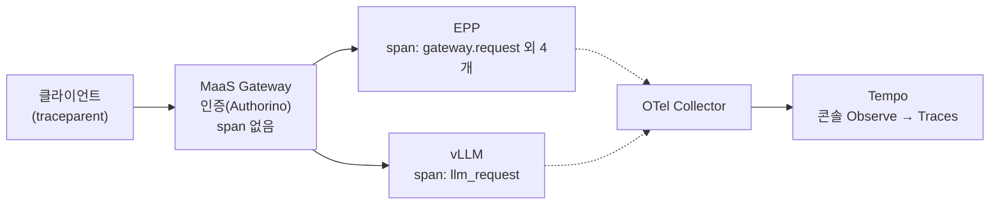
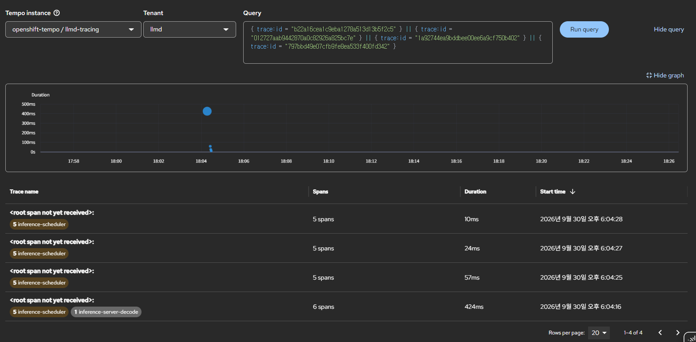
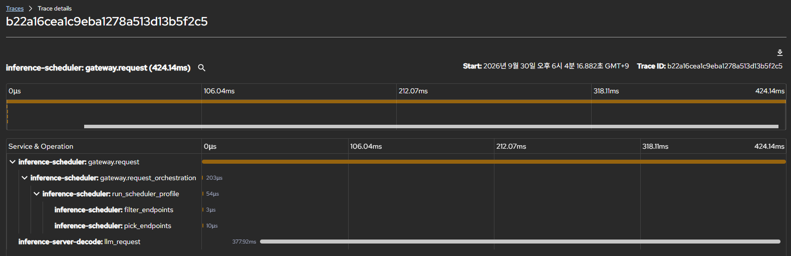

# 시나리오 25: 에러 트레이싱

**모듈:** 서빙 및 추론 > 분산 추론 (GA)
**관련 컴포넌트:** `spec.tracing`, EPP, vLLM, OpenTelemetry Collector, Tempo, MaaS Gateway

## 목적

실패한 요청을 trace로 찾고 실패 지점을 식별할 수 있는지 검증한다. 정상 요청의 구간 분석은 시나리오 13에서 다루었다.

## 구성



`LLMInferenceService`의 `spec.tracing`을 켜면 컨트롤러가 EPP와 vLLM에 OpenTelemetry 설정을 넣는다. **span**은 trace를 이루는
작업 하나의 기록(이름, 서비스, 시작 시각, 소요 시간, 속성)이며, 같은 요청의 span은 같은 trace ID로 이어진다.

## 하네스 실행

```sh
S25_KEEP=true ./harness.sh scenario25-llmd-tracing      # 정상 5건 + 실패 3건, trace 유지(콘솔 확인용)
TRACING=off ./harness.sh llmd-tracing                   # 확인 후 tracing 끄기
```

| 요청 | 방법 |
|---|---|
| 정상 | 짧은 프롬프트, `max_tokens` 64 |
| 실패 ① 요청 검증 | `max_tokens` 99999 (컨텍스트 한도 초과) |
| 실패 ② 없는 모델 | `model: no-such-model` |
| 실패 ③ 인증 | 잘못된 API 키 |

## 판정 기준

| 지표 | 통과 조건 |
|---|---|
| 실패 요청의 trace | 실패 여부와 실패 지점을 trace에서 식별 가능 |

## 결과 (2026-09-30, Qwen2.5-1.5B-Instruct, MaaS Gateway 경유)

**미통과.** 실패 요청은 trace에 오류로 표시되지 않았다. 실패 지점은 Gateway access log로만 식별되었다.

| 요청 | HTTP | 응답 주체 (access log) | trace에 남은 span | 오류 표시 |
|---|---|---|---|---|
| 정상 | 200 | vLLM | EPP 5개 + **vLLM `llm_request`** (큐·prefill·decode 시간) | - |
| ① 요청 검증 | 400 | vLLM | EPP 5개 (58 ms) | 없음 |
| ② 없는 모델 | 404 | vLLM | EPP 5개 (25 ms) | 없음 |
| ③ 인증 | 403 | Gateway (MaaS 인증) | EPP 5개 (11 ms) | 없음 |



*그림 1. 콘솔 Observe → Traces에서 4개 trace ID를 OR 조건으로 검색. 정상 요청(424 ms, 6 spans)만
`inference-server-decode`(vLLM) span을 가지며, 실패 3건(57 ms, 24 ms, 10 ms)은 `inference-scheduler`(EPP) span 5개뿐이고
오류 표시가 없다.*



*그림 2. 정상 요청 trace(424 ms). EPP의 Pod 선택(`run_scheduler_profile` 54 µs, `pick_endpoints` 10 µs) 뒤에 vLLM
`llm_request`(378 ms)가 이어진다. 실패 요청에는 마지막 `llm_request` 줄이 없다.*

**vLLM span이 없는 이유.** vLLM은 추론 엔진이 요청 처리를 마칠 때 `llm_request` span을 만든다. 400·404는 그 전 단계인
HTTP API 서버의 모델 확인·요청 검증에서 거절되어 span이 생성되지 않는다(vLLM 로그에는 400·404가 기록됨). 403은 Gateway
인증에서 거절되어 vLLM에 도달하지 않았다.

```
vLLM:  HTTP 수신 → ① 모델 확인(404) → ② 요청 검증(400) → ③ 추론 엔진: 큐 → prefill → decode → 완료 시 span 생성
```

**오류 표시가 없는 이유.** 최종 HTTP 응답 코드를 span에 기록하는 구성 요소가 없다. EPP는 Pod 선택까지만 관여하고,
Gateway(Envoy)는 span을 만들지 않는다.

**인증 실패 요청도 EPP를 거친다.** 잘못된 API 키 요청이 403으로 거절되기 전에 EPP가 요청을 받아 Pod를 선택하였다.
EPP 호출이 인증 판정보다 먼저 실행되는 것으로 보인다(필터 순서는 미확인).

## Gateway tracing 검토

Gateway가 span을 만들면 응답 코드와 오류가 trace에 표시된다. 그러나 이 Gateway의 Istio(`istiod-openshift-gateway`)는
OpenShift Ingress operator가 관리(`managed-by: sail-library`)하며, mesh 설정에 tracing 수신처(`extensionProviders`)가 없다.
`Telemetry` 리소스로 켜려면 operator 관리 설정을 바꿔야 하므로 지원되는 방법이 없다(조회만 수행, 변경하지 않음).

## 운영 가이드

| 이슈 내역 | 도구 |
|---|---|
| 요청이 느린 이유 (큐, prefill, decode) | trace (시나리오 13) |
| 요청이 실패했는지, 어디서 실패했는지 | Gateway access log (응답 코드, `via_upstream` 여부, 도착 Pod) |
| 실패 추이 | Grafana `Gateway failures by cause` |
| 실패 요청의 trace | vLLM span이 없는 짧은 trace로 추정 (원인은 access log로 확인) |

```sh
# 실패 요청 (응답 코드 4xx/5xx)
oc logs -n openshift-ingress <maas-default-gateway Pod> | grep -E '" (4|5)[0-9]{2} '
```

콘솔 Observe → Traces(`openshift-tempo/llmd-tracing`, tenant `llmd`) 검색 조건:

| 검색 방법 | TraceQL |
|---|---|
| 정상 요청 (vLLM 도달) | `{ resource.service.name = "inference-server-decode" && name = "llm_request" }` |
| 실패 요청 후보 | `{ name = "gateway.request" && duration < 100ms }` |
| trace ID | `{ trace:id = "<trace-id>" }` |

- 클라이언트가 보낸 `traceparent`의 부모 span은 Tempo에 없으므로 목록에 `<root span not yet received>`가 표시된다.
- 개선 방안: 실패 추적을 위해 OpenShift Logging으로 access log를 수집하고, Gateway tracing 지원을 Red Hat에 요청한다.
