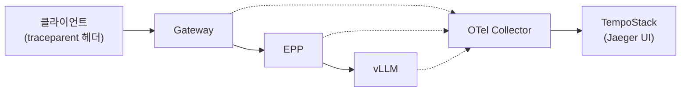

# 시나리오 25: 엔드-투-엔드 분산 트레이싱

**모듈:** 서빙 및 추론 > 분산 추론 (GA)
**관련 컴포넌트:** `spec.tracing`, preset `v3-5-1-kserve-config-llm-tracing`, OpenTelemetry Collector, TempoStack

## 목적

RHOAI 3.5의 네이티브 `spec.tracing` 설정으로 Gateway → EPP → vLLM 전 구간의 span을 하나의 trace로
수집하고, 구간별 지연과 에러 지점을 식별할 수 있음을 검증한다. 시나리오 13(vLLM 인자 방식, 부분 실측)의
GA 방식 재검증이다.

## 구성



preset 기본값: `exporter: otlp`, `exporterEndpoint: http://otel-collector:4317`,
`sampler: parentbased_traceidratio`, `samplerArg: "0.05"`. 데모에서는 샘플링 비율을 1.0으로 올린다.

## 하네스 실행

```sh
./harness.sh tracing && ./harness.sh scenario25-llmd-tracing   # 여유 GPU 1장 필요
```

수동 절차는 아래와 같으며, 하네스 명령은 동일 절차를 수행하고 설정을 원복한다.

## 절차

```sh
./harness.sh tracing                                   # Tempo + OTel 준비 (1회)
NS=llmd-s26; NAME=llmd-trace
oc patch llminferenceservice $NAME -n $NS --type=merge -p '{"spec":{"tracing":{
  "exporter":"otlp","exporterEndpoint":"http://<collector>.<ns>.svc:4317",
  "sampler":"parentbased_traceidratio","samplerArg":"1.0"}}}'
oc get pod -n $NS -l app.kubernetes.io/name=$NAME -o jsonpath='{.items[0].spec.containers[0].env}' | grep -i otel
# 1) 정상 요청 10회 → Jaeger UI에서 service별 span 확인
# 2) 긴 출력(max_tokens 1024) 요청 → decode 구간 span 비중 확인
# 3) 오류 요청(존재하지 않는 model, 컨텍스트 초과) → 에러 span 위치 확인
```

## 판정 기준

| 지표 | 통과 조건 |
|---|---|
| trace 연결성 | 한 요청의 Gateway/EPP/vLLM span이 동일 trace ID로 연결 |
| 구간 지연 | EPP 스케줄링 시간, vLLM 큐/prefill/decode 시간 식별 가능 |
| 에러 추적 | 거부 요청의 실패 지점(span status=error) 식별 가능 |

## 실측 결과 (2026-09-23, RHOAI 3.5.1, Qwen2.5-1.5B-Instruct, T4 × 2, MaaS Gateway 경유)

**통과(정상 요청). 오류 추적은 부분적.**

`spec.tracing` 한 번의 설정으로 컨트롤러가 두 컴포넌트에 OTel 설정을 주입하였다. OTel Collector 없이
Tempo distributor(`tempo-llmd-tracing-distributor.openshift-tempo.svc:4317`)로 직접 수신된다.

| 컴포넌트 | 서비스 이름 | 주입 내용 |
|---|---|---|
| vLLM | `inference-server-decode` | `OTEL_*` 환경변수, `--otlp-traces-endpoint`, `--collect-detailed-traces` |
| EPP | `inference-scheduler` | `OTEL_*` 환경변수, `--tracing=true` |

정상 요청 trace(클라이언트 `traceparent` 전달, 동일 trace ID로 연결):

```
+0.0ms   2893.5ms  inference-scheduler      gateway.request
+0.1ms      0.3ms  inference-scheduler      gateway.request_orchestration
+0.2ms      0.1ms  inference-scheduler      run_scheduler_profile
+0.2ms      0.0ms  inference-scheduler      filter_endpoints
+0.3ms      0.0ms  inference-scheduler      pick_endpoints        candidate_endpoints=2
+46.5ms  2842.0ms  inference-server-decode  llm_request
```

`llm_request` span 속성으로 구간별 지연이 분해된다: `gen_ai.latency.time_in_queue`,
`time_in_model_prefill`, `time_in_model_decode`, `time_to_first_token`, `gen_ai.usage.prompt_tokens`/`completion_tokens`.
`pick_endpoints`에는 후보 수와 선택 endpoint(`llm_d.epp.picker.top_endpoints`)가 기록된다.

오류 요청(`max_tokens` 초과, HTTP 400)의 trace는 EPP span 5개만 존재하였고(39ms), vLLM span과 오류 상태
태그는 없었다. 요청 검증 단계에서 거부된 요청은 "vLLM span 부재"로만 간접 식별된다.

## 운영상 유의 사항

- Gateway(Envoy)와 MaaS 인증(Authorino) 구간은 trace에 포함되지 않는다. 인증 지연(시나리오 23의 200ms
  타임아웃)은 trace로 관측할 수 없다.
- Jaeger UI는 TempoStack의 `jaegerQuery.ingress.type: route`로 노출한다. 수동 `oc expose` Route는 Tempo
  operator가 제거한다. operator Route는 OpenShift OAuth(브라우저 로그인)로 보호되며 Bearer 토큰 API 호출은
  거부된다(API 검증은 `oc port-forward svc/tempo-llmd-tracing-query-frontend 16686`).
- 샘플링 비율 기본값은 0.05(preset)이며 데모에서는 `samplerArg: "1.0"`을 사용한다.

## 검증 필요 사항

- P/D 분리 구성(prefill/decode 별도 pod)에서 prefill span 분리 여부
