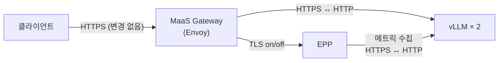

# 시나리오 26: 내부 TLS 비활성화

**모듈:** 서빙 및 추론 > 분산 추론 (GA)
**관련 컴포넌트:** DSC `enableLLMInferenceServiceTLS`, EPP, vLLM

## 목적

llm-d 내부 구간의 TLS를 끄면 추론 속도가 얼마나 달라지는지 측정한다.

1. **Full HTTPS** (기본): 클라이언트 → Gateway와 내부 구간 모두 TLS
2. **Only Envoy HTTPS**: 클라이언트 → Gateway만 HTTPS, 내부 구간은 평문

## 구성



클러스터 전역 설정 하나로 EPP와 vLLM이 함께 바뀌며, 변경 시 모든 `LLMInferenceService`가 재시작된다.

```sh
oc patch dsc default-dsc --type=merge -p '{"spec":{"components":{"kserve":{"enableLLMInferenceServiceTLS":false}}}}'
```

## 하네스 실행

```sh
./harness.sh scenario26-llmd-tls        # 1) 측정 → 2)로 전환 → 측정 → 원복 (약 25분)
```

부하: 동시성 16, 출력 128 토큰, 120초, 구성별 2회, MaaS Gateway 경유.

## 결과 (2026-09-30, Qwen2.5-1.5B-Instruct, A10G × 2)

**차이 없음.** 모든 지표의 변화가 2 % 이내로 측정 오차 범위이다.

| 지표 | 1) Full HTTPS (1회 / 2회) | 2) Only Envoy HTTPS (1회 / 2회) | 평균 변화 |
|---|---|---|---|
| 처리량 | 19.14 / 18.86 req/s | 18.87 / 19.05 req/s | −0.2 % |
| TTFT p50 | 0.436 / 0.453 s | 0.447 / 0.450 s | +0.9 % |
| TTFT p95 | 0.639 / 0.866 s | 0.649 / 0.834 s | −1.5 % |
| E2E p50 | 0.826 / 0.845 s | 0.834 / 0.836 s | −0.1 % |
| E2E p95 | 1.037 / 1.274 s | 1.044 / 1.227 s | −1.7 % |

- 2)에서 vLLM ssl 인자 제거, probe HTTP, EPP `--secure-serving=false`로 바뀐 것을 확인하였다.
- 2) 1회차의 HTTP 500 15건은 부하 시작 순간 MaaS 인증(Authorino) 기한 초과로, TLS와 무관하다(`lessonlearn.md` 2026-09-29).
- 병목이 GPU 연산이므로 내부 TLS를 꺼도 속도 이득이 없다. 성능 목적으로 끌 이유는 없다.
