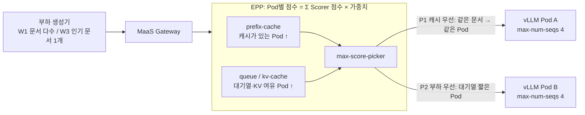
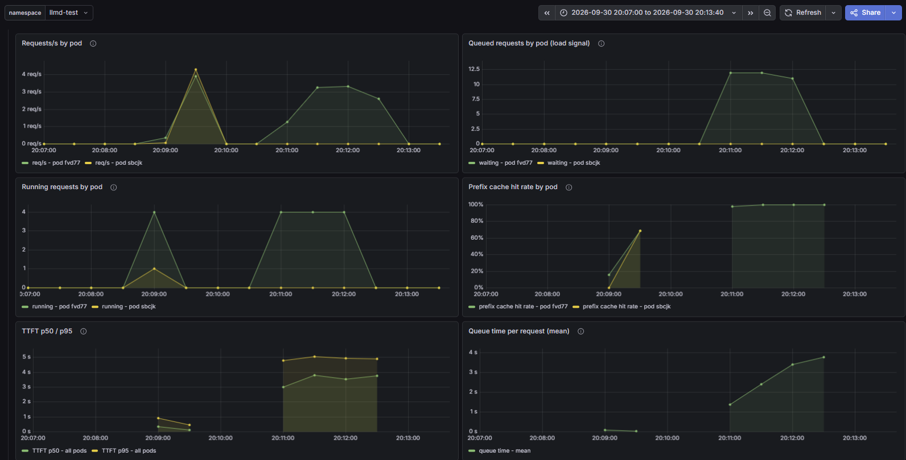
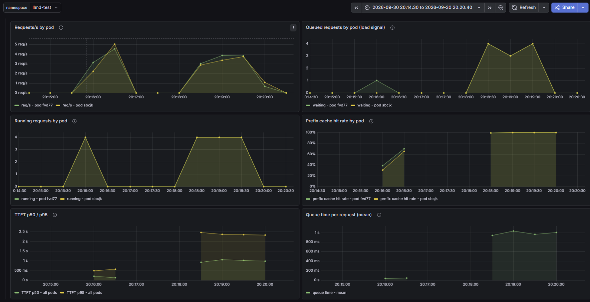

# 시나리오 27: Scorer 가중치 정책 비교

**모듈:** 서빙 및 추론 > 분산 추론 (GA)
**관련 컴포넌트:** EPP `EndpointPickerConfig`, `prefix-cache-scorer`, `queue-scorer`, `kv-cache-utilization-scorer`

## 목적

Scorer 가중치를 워크로드에 맞게 바꾸면 라우팅과 지연이 의도대로 달라지는지 검증한다. 시나리오 22가 각 Scorer의 역할을
보였다면, 본 시나리오는 어떤 워크로드에 어떤 가중치가 유리한지를 비교한다.

## 구성



vLLM 동시 처리 한도를 4로 두어 대기열이 생기게 한다. 대기열이 있어야 부하 Scorer(queue, kv-cache)가 Pod 간 차이를 만든다.

| 정책 | prefix-cache | queue | kv-cache | no-hit-lru | 의도 |
|---|---|---|---|---|---|
| 기본값 | 3 | 2 | 2 | 2 | 절충 |
| **P1 캐시 우선** | 5 | 1 | 1 | 1 | 같은 문서는 캐시가 있는 Pod로 |
| **P2 부하 우선** | 1 | 3 | 3 | 1 | Pod 간 부하 균등 |

| 워크로드 | 요청 | 특성 |
|---|---|---|
| **W1 문서 다수** | 문서 150종(약 5,400 토큰) 중 무작위, 450건, 동시성 8 | 캐시 신호 있음, 부하 신호 약함 (예: 여러 문서 RAG) |
| **W3 인기 문서 1개** | 문서 1종, 90초, 동시성 16 | 캐시 신호 매우 강함, 동시 16건 > 두 Pod 한도 합 8 (예: 공통 긴 시스템 프롬프트) |

캐시 신호가 없는 W2(매번 다른 긴 프롬프트)는 두 정책의 결과가 같아(2026-09-23) 이번에는 생략하였다.

## 하네스 실행

```sh
S27_WORKLOADS="W1 W3" ./harness.sh scenario27-llmd-scorer-weights     # 정책 2 × 워크로드 2, 약 15분, EPP 원복
```

정책을 바꾸면 EPP만 재시작되고(약 1분) vLLM은 재시작되지 않는다.

## 결과 (2026-09-30, Qwen2.5-1.5B-Instruct, A10G × 2, MaaS Gateway 경유)

**W1은 캐시 우선, W3는 부하 우선이 유리하였다.**

| 조합 | 처리량 | TTFT p50 / p95 | prefix 적중률 | Pod 분포 |
|---|---|---|---|---|
| W1 × **P1 캐시 우선** | **15.45 req/s** | **0.188 / 0.402 s** | **68.3 %** | 228 : 222 |
| W1 × P2 부하 우선 | 13.45 req/s | 0.225 / 0.561 s | 55.3 % | 231 : 219 |
| W3 × P1 캐시 우선 | 3.33 req/s | 3.52 / 4.85 s | 99.6 % | **314 : 0** |
| W3 × **P2 부하 우선** | **7.33 req/s** | **1.03 / 1.98 s** | 99.6 % | 343 : 333 |

- **W1:** 캐시 우선이 적중률 +13 %p, TTFT p50 16 % 단축, 처리량 15 % 증가. 문서가 많아 캐시 우선에서도 분포가 고르다.
- **W3:** 캐시 우선은 모든 요청을 한 Pod로 보냈다. 부하 우선은 두 Pod로 나누어 TTFT p50이 3.4배 빠르고 처리량이 2.2배 높았다.
  문서가 하나이므로 두 Pod 모두 캐시를 가져 적중률은 같았다.



*그림 1. P1 캐시 우선(20:07~20:13). 왼쪽 봉우리가 W1(20:09~20:10), 오른쪽이 W3(20:11~20:13)이다.*



*그림 2. P2 부하 우선(20:14~20:20). 왼쪽 봉우리가 W1(20:15~20:16), 오른쪽이 W3(20:18~20:20)이다.*

**그래프 분석 (W3 구간)**

| 패널 | 그림 1. P1 캐시 우선 | 그림 2. P2 부하 우선 | 해석 |
|---|---|---|---|
| Requests/s by pod | `fvd77`만 약 3.3 req/s, `sbcjk`는 0 | 두 Pod 각 약 3~3.8 req/s | P1은 캐시가 있는 한 Pod만 계속 선택한다. |
| Queued requests by pod | `fvd77`에 최대 약 12건 대기 | 최대 약 4건 | 한 Pod에 몰리면 한도(4)를 넘는 요청이 대기열에 쌓인다. |
| Running requests by pod | `fvd77`만 한도 4로 가득, `sbcjk`는 0 | 두 Pod 모두 처리 중 | P1에서는 GPU 1장이 놀고 있다. |
| Prefix cache hit rate by pod | `fvd77` 약 100 % (`sbcjk`는 요청 없음) | 두 Pod 모두 약 100 % | 문서가 하나라 나누어도 캐시 손해가 없다. |
| TTFT p50 / p95 | p50 3~3.8 s, p95 약 5 s | p50 약 1.0 s, p95 약 2.4 s | 대기 시간이 그대로 TTFT에 더해진다. |
| Queue time per request | 1.3 s → 3.8 s로 증가 | 약 1.0 s로 일정 | P1은 시간이 지날수록 대기가 누적된다. |

W1 구간(왼쪽 봉우리)은 두 그림 모두 두 Pod가 고르게 받고 대기열이 거의 없어, 정책에 따른 차이가 캐시 적중률과 TTFT에서만 나타난다.

## 운영 가이드

| 워크로드 | 권장 가중치 | 근거 |
|---|---|---|
| 문서·세션이 다양함 (RAG, 멀티턴) | 캐시 우선 (prefix ↑) | W1 |
| 소수 인기 prefix에 요청 집중 (공통 시스템 프롬프트, 인기 문서) | 부하 우선 (queue·kv ↑) | W3 |
| 혼합 또는 미상 | 기본값 (prefix 3, queue 2, kv 2, lru 2) | 절충 |

- 부하 Scorer는 대기열이 실제로 생길 때만 효과가 있다. `Queued requests by pod`가 한 Pod에만 쌓이면 부하 쪽 가중치를 높인다.
- `scheduler.config`를 제거해도 기본값으로 돌아가지 않는다. 기본 구성을 인라인으로 다시 지정한다(`lessonlearn.md` 2026-09-23).
