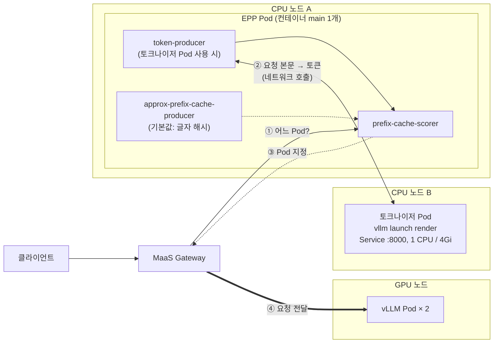
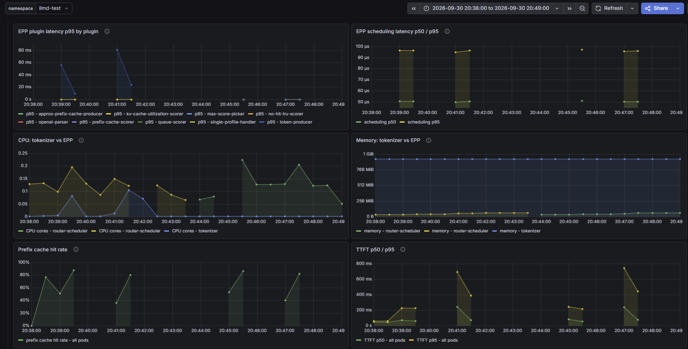

# 시나리오 28: 외부 토크나이저

**모듈:** 서빙 및 추론 > 분산 추론 (GA)
**관련 컴포넌트:** 토크나이저 preset(`vllm launch render`), EPP `token-producer`, `prefix-cache-scorer`

## 목적

같은 프롬프트에서 **토크나이저 Pod 사용**과 **글자 해시(기본값, 토크나이저 미사용)** 를 비교하여, 프롬프트 길이에 따른 라우팅 품질과 비용 차이를 측정한다.

## 구성



- EPP, 토크나이저, vLLM은 각각 별도 Pod이며 서로 다른 노드에 스케줄된다. 토크나이저는 EPP의 사이드카가 아니다.
- **글자 해시 (기본값):** EPP Pod 안의 `approx-prefix-cache-producer`가 토크나이저 없이 요청 글자로 앞부분을 비교한다.
  1. 요청 본문(프롬프트 글자)을 일정 길이의 조각으로 자른다.
  2. 조각마다 해시를 만든다. 앞 조각의 해시를 이어 붙이므로 앞부분이 같아야 같은 해시가 나온다.
  3. "어느 Pod에 어떤 해시를 보냈는지" 기록과 비교하여, 앞에서부터 해시가 가장 많이 일치하는 Pod에 높은 점수를 준다.
  4. 요청을 보낸 뒤 이 해시들을 해당 Pod에 보낸 것으로 기록한다.

  vLLM은 토큰 16개 블록 단위로 캐시하지만 이 방식은 글자 조각으로 비교하고, vLLM이 캐시를 지워도 알지 못한다(보낸 기록으로 가정).
  그래도 같은 문서는 글자가 같아 같은 해시가 되므로, 같은 앞부분의 요청을 같은 Pod로 보내는 목적에는 충분하다.
  EPP가 토큰화를 하지 않으므로, 토크나이저 Pod가 떠 있어도 EPP는 이를 호출하지 않는다.
- **토크나이저 Pod 사용:** 1번에서 글자 대신 vLLM과 같은 토큰으로 자른다. EPP의 `token-producer`가 토크나이저 Service를
  네트워크로 호출해 토큰을 받고(②), `prefix-cache-scorer`가 이 토큰으로 비교한다. 보낸 기록으로 캐시를 가정하는 점(3, 4번)은 같다. 모든 요청의 라우팅이 토크나이저 Pod에 의존하게 된다.
- EPP는 Pod를 지정만 하고(③), 요청 전달은 Gateway가 한다(④).

**설정.** 토크나이저 Pod는 preset(`baseRefs: v3-5-1-kserve-config-llm-tokenizer`)으로 기동하고, EPP에 `token-producer`를 추가한다.
`modelName`은 서빙 모델명이 아닌 render 서버의 모델 ID(`/mnt/models/base`)여야 한다. 틀리면 render 호출이 404가 되고
prefix Scorer가 0점을 주어 캐시 인지 라우팅이 무력화된다.

```yaml
- type: token-producer
  parameters:
    modelName: /mnt/models/base
    vllm:
      url: https://llmd-test-tokenizer.llmd-test.svc.cluster.local:8000
```

## 하네스 실행

```sh
./harness.sh scenario28-llmd-tokenizer      # S28_SIZES="1000 3500" (문서 길이, 단어), 약 15분, EPP 원복
```

부하: 문서 150종 × 450건, 동시성 8, 출력 16 토큰. 토크나이저 Pod 사용 → 글자 해시 순으로 같은 길이의 프롬프트를 측정한다.

## 결과 (2026-09-30, Qwen2.5-1.5B-Instruct, A10G × 2, MaaS Gateway 경유)

**라우팅 품질은 같고, 토크나이저 Pod 사용은 프롬프트 길이에 비례하는 비용만 추가되었다.**

두 방식 모두 토크나이저 Pod는 떠 있다(`llmd-test`에 preset 포함). 글자 해시 방식에서는 EPP가 요청 글자를 직접 해시하므로,
토큰을 받으려고 토크나이저 Pod를 호출하지 않는다.

| 지표 | 토크나이저 Pod (1,027 토큰) | 글자 해시 (1,027 토큰) | 토크나이저 Pod (3,527 토큰) | 글자 해시 (3,527 토큰) |
|---|---|---|---|---|
| 처리량 | 20.81 req/s | 20.81 req/s | 14.06 req/s | 14.23 req/s |
| TTFT p50 / p95 | 0.114 / 0.243 s | 0.114 / 0.251 s | 0.206 / 0.566 s | 0.197 / 0.588 s |
| prefix 적중률 | 67.1 % | 67.0 % | 68.1 % | 68.3 % |
| **토큰화 지연 p95** | **9.9 ms** | **0.1 ms** | **23.5 ms** | **0.1 ms** |
| EPP 스케줄링 지연 p95 | 0.1 ms | 0.1 ms | 0.1 ms | 0.1 ms |
| 토크나이저 CPU 최대 | 0.08 코어 | 유휴 | 0.11 코어 | 유휴 |



*그림 1. Grafana `External tokenizer (scenario 28)`. 20:38~20:42가 토크나이저 Pod 사용, 20:44~20:48이 글자 해시이며,
각 구간의 두 봉우리가 1,027 토큰과 3,527 토큰 측정이다.*

| 패널 | 토크나이저 Pod 사용 구간 | 글자 해시 구간 | 해석 |
|---|---|---|---|
| EPP plugin latency p95 by plugin | `token-producer`가 봉우리마다 56 ms, 81 ms까지 상승 | `approx-prefix-cache-producer` 등 모든 plugin이 0 근처 | 토큰화 비용은 토크나이저 Pod 호출에서만 발생한다. 1분 창의 p95라 부하 시작 순간이 크게 보인다. |
| EPP scheduling latency | p50 약 50 µs, p95 약 95 µs | 같음 | Pod 선택 자체의 비용은 같다. 토큰화 시간은 여기에 포함되지 않는다. |
| CPU: tokenizer vs EPP | 토크나이저 최대 약 0.1 코어, EPP 0.1~0.2 코어 | 토크나이저 0 | 토큰화 부하는 토크나이저 Pod로 옮겨 가지만 규모가 작다. |
| Memory: tokenizer vs EPP | 토크나이저 약 950 MiB로 일정 | 같음 | 토크나이저는 호출과 무관하게 모델 어휘집을 메모리에 올려 둔다. EPP는 약 50 MiB. |
| Prefix cache hit rate | 봉우리마다 80~87 %까지 상승 | 같은 모양 | 두 방식이 같은 Pod를 고른다. |
| TTFT p50 / p95 | 봉우리 초반이 높고 캐시가 차며 낮아짐 | 같은 모양 | 최종 지연 차이는 오차 범위이다. |

## 운영 가이드

- 텍스트 요청의 캐시 인지 라우팅에는 글자 해시(기본값)으로 충분하다. 토크나이저 Pod 사용은 적중률 이득 없이 요청당
  10~24 ms(프롬프트 길이에 비례)와 별도 Pod(약 1 GiB 메모리)를 추가한다.
- 토크나이저 Pod를 쓰면 이 Pod가 모든 요청의 라우팅 경로에 들어간다. replica 1개는 단일 장애점이므로 replica를 늘리고
  장애 시 동작을 검증한다(미검증).
- 토크나이저 Pod가 의미 있는 경우는 vLLM과 같은 토큰이 필요한 기능과 함께 쓸 때이다(예: vLLM KV 캐시 이벤트 기반 정밀 추적, 본 빌드 지원 여부 미확인).
