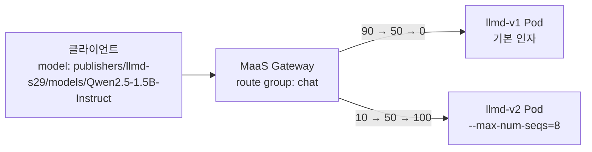

# 시나리오 29: Controlled Deployment (가중치 기반 트래픽 분할)

**모듈:** 서빙 및 추론 > 분산 추론 (GA)
**관련 컴포넌트:** `spec.router.route.group`/`weight`, HTTPRoute, MaaS 공통 엔드포인트

## 목적

v1과 v2의 가중치를 90:10 → 50:50 → 0:100으로 옮길 때, Gateway가 요청을 가중치대로 나누고 요청이 실패하지 않는지 검증한다.

## 구성



- v1과 v2는 같은 모델의 `LLMInferenceService` 2개이며, 같은 `route.group`을 가진다. 컨트롤러는 `route.weight`를 HTTPRoute 가중치로 설정한다.
- 두 버전 모두 EPP를 켜지 않는다. 한 Gateway에 EPP 모델이 2개면 EPP 연결이 잘못되기 때문이다(시나리오 24).

```sh
oc patch llminferenceservice llmd-v1 -n llmd-s29 --type=merge -p '{"spec":{"router":{"route":{"group":"chat","weight":50}}}}'
```

## 하네스 실행

```sh
./harness.sh llmd-test-down && ./harness.sh scenario29-llmd-canary-up
./harness.sh scenario29-llmd-canary-shift          # 요청을 계속 보내며 가중치 변경, 단계별 90초 측정
./harness.sh scenario29-llmd-canary-down && ./harness.sh llmd-test-up
```

## 결과 (2026-09-30, Qwen2.5-1.5B-Instruct, A10G × 1씩)

**통과.** Gateway는 설정 가중치와 3 %p 이내로 요청을 나누었고, 요청 1,508건이 모두 성공하였다.

| 설정 v1 : v2 | 실측 v1 : v2 | v1 비율 |
|---|---|---|
| 90 : 10 | 418 : 41 | 91 % |
| 50 : 50 | 190 : 170 | 53 % |
| 0 : 100 | 0 : 202 | 0 % |

- TTFT p50은 전환 중에도 0.065 s로 일정하였다.
- 클라이언트는 공통 엔드포인트로 요청해야 가중치가 적용된다. 버전별 경로(`/llmd-s29/llmd-v1/...`)는 가중치를 거치지 않는다.
- 가중치 분할과 EPP(캐시 인지 라우팅)는 현재 함께 쓸 수 없다.
