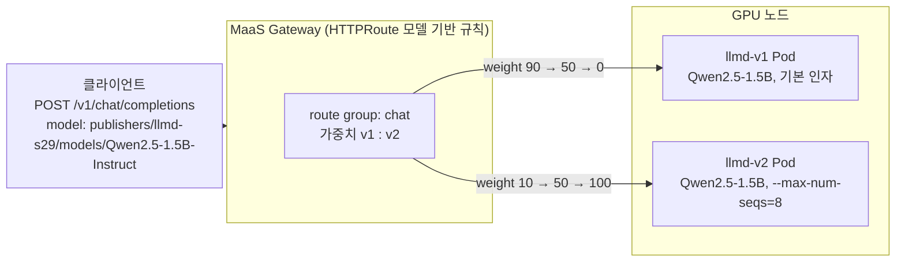

# 시나리오 29: Controlled Deployment (가중치 기반 트래픽 분할)

**모듈:** 서빙 및 추론 > 분산 추론 (GA)
**관련 컴포넌트:** `spec.router.route.group`/`weight`, HTTPRoute 모델 기반 규칙, MaaS 공통 엔드포인트

## 목적

운영자가 한 모델 엔드포인트 뒤에 v1과 v2를 함께 운영하면서 가중치를 90:10 → 50:50 → 0:100으로 옮길 때, Gateway가 요청을
가중치대로 나누고 요청이 한 건도 실패하지 않는지 검증한다.

## 구성



- v1과 v2는 같은 namespace(`llmd-s29`)에 있는 같은 모델명의 `LLMInferenceService` 2개이며, 각각 replica 1(GPU 1)이다.
  v2는 엔진 인자 하나(`--max-num-seqs=8`)만 다르다.
- 운영자가 두 `LLMInferenceService`에 같은 `spec.router.route.group`(`chat`)을 지정하면, 컨트롤러는 HTTPRoute의 모델 기반
  규칙에 두 버전의 워크로드 Service를 넣고 `spec.router.route.weight` 값을 가중치로 설정한다. 클라이언트는 공통 엔드포인트
  하나로 요청하고, Gateway는 가중치에 따라 v1 또는 v2로 요청을 보낸다.
- 두 버전 모두 EPP를 켜지 않는다. 한 Gateway에 EPP 모델이 2개 이상이면 Gateway가 모든 경로를 마지막에 생성된 EPP에 연결하므로
  (시나리오 24 주의 사항), 본 시나리오는 버전 간 트래픽 이동만 검증한다.

```yaml
# llmd-v1                                  # llmd-v2
spec:
  router:
    route: {group: chat, weight: 90}       #   route: {group: chat, weight: 10}
```

```sh
oc patch llminferenceservice llmd-v1 -n llmd-s29 --type=merge -p '{"spec":{"router":{"route":{"group":"chat","weight":50}}}}'
```

## 하네스 실행

```sh
./harness.sh llmd-test-down && ./harness.sh scenario29-llmd-canary-up     # v1·v2 배포(EPP 없음), MaaS 등록
./harness.sh scenario29-llmd-canary-shift                                # S29_STEPS="90:10 50:50 0:100"
./harness.sh scenario29-llmd-canary-down && ./harness.sh llmd-test-up
```

`scenario29-llmd-canary-shift`는 부하 생성기가 공통 엔드포인트로 요청을 계속 보내는 동안(동시성 2, 0.2초 간격) 가중치를 단계별로
바꾼다. 스크립트는 단계마다 20초를 기다린 뒤 90초 동안 버전별 vLLM 처리 건수를 세어 실제 비율을 계산한다.

## 판정 기준

| 지표 | 통과 조건 |
|---|---|
| 버전별 요청 비율 | 설정 가중치 ±5 %p 이내 |
| 가중치 변경 중 클라이언트 실패 | 0건 |

## 결과 (2026-09-30, Qwen2.5-1.5B-Instruct v1/v2, A10G × 1씩, MaaS Gateway 경유)

**통과.** Gateway가 요청을 설정 가중치와 3 %p 이내로 나누었고, 가중치를 두 번 바꾸는 동안 요청 1,508건이 모두 성공하였다.

| 설정 가중치 v1 : v2 | 실측 v1 : v2 (건) | v1 비율 | 차이 |
|---|---|---|---|
| 90 : 10 | 418 : 41 | 91 % | +1 %p |
| 50 : 50 | 190 : 170 | 53 % | +3 %p |
| 0 : 100 | 0 : 202 | 0 % | 0 %p |

| 지표 | 값 |
|---|---|
| 요청 성공 / 전체 | 1,508 / 1,508 (실패 0건) |
| TTFT p50 / p95 | 0.065 s / 0.084 s |
| E2E p50 / p95 | 0.308 s / 0.324 s |

- 컨트롤러는 EPP 없이도 가중치를 적용하였다. HTTPRoute의 공통 엔드포인트용 규칙 7개가 모두 `llmd-v1-kserve-workload-svc`(90)와
  `llmd-v2-kserve-workload-svc`(10)를 목적지로 가졌다.
- 2026-09-23 측정(EPP 켬)에서는 858건 중 2건이 실패하였으나, EPP를 끈 이번 측정에서는 실패가 없었다.
- 단계별 건수는 Prometheus 수집 주기(30초) 때문에 측정 구간 길이가 조금씩 달라 합계가 다르다. 판정에는 비율을 사용한다.
- v2가 그룹에 합류할 때 컨트롤러는 `MemberDivergence` 경고를 한 번 기록하였고, 두 버전을 수 초간 NotReady로 표시한 뒤 Ready로
  되돌렸다. 두 버전의 모델명·URI·LoRA 설정은 같았으며, 가중치 규칙은 정상으로 생성되었다.

## 운영 가이드

- 새 버전을 배포할 때는 두 `LLMInferenceService`에 같은 `route.group`을 주고 `weight`를 조금씩 옮긴다. 가중치 변경은 수 초 안에
  반영되며, 요청은 중단되지 않는다.
- 클라이언트는 버전별 경로(`/llmd-s29/llmd-v1/...`)가 아닌 공통 엔드포인트(`model: publishers/<ns>/models/<model>`)로 요청해야
  가중치가 적용된다.
- 가중치 분할과 캐시 인지 라우팅(EPP)은 현재 함께 쓸 수 없다. 두 버전이 각자 EPP를 가지면 한 Gateway에 EPP 모델이 2개가 되어,
  버전 안의 Pod 선택에 EPP가 적용되지 않는다.
- Grafana `llm-d Observability` > `Canary (scenario 29)` 행(namespace `llmd-s29`)에서 버전별 req/s, 트래픽 비율, TTFT, Gateway
  실패를 본다.
