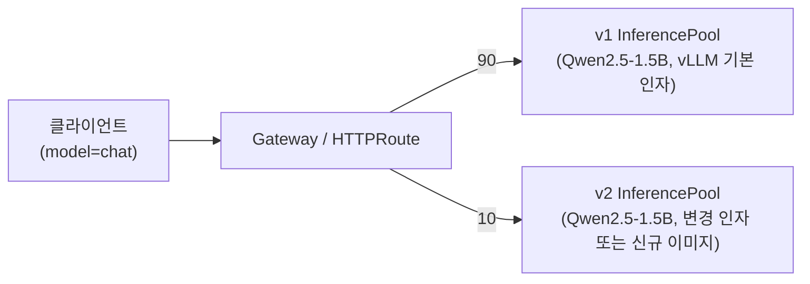

# 시나리오 29: Controlled Deployment (가중치 기반 트래픽 분할)

**모듈:** 서빙 및 추론 > 분산 추론 (GA)
**관련 컴포넌트:** `spec.router.route.group`/`weight`, HTTPRoute 모델 기반 라우팅 규칙, MaaS 공통 엔드포인트

## 목적

단일 모델 엔드포인트 뒤에 v1/v2 워크로드를 동시 운영하고, 가중치(90:10 → 50:50 → 0:100)로
트래픽을 이동하는 동안 활성 요청이 중단되지 않으며 버전별 메트릭을 분리 관측할 수 있음을 검증한다.

## 구성



- v1/v2: 각각 `LLMInferenceService` 1개 (GPU 2)
- v2 변경점: 엔진 인자(예: `--max-num-seqs`) 또는 모델 버전 중 하나로 한정한다.

## 하네스 실행

```sh
./harness.sh llmd-test-down && ./harness.sh scenario29-llmd-canary-up
./harness.sh scenario29-llmd-canary-shift             # S29_STEPS="90:10 50:50 0:100"
./harness.sh scenario29-llmd-canary-down && ./harness.sh llmd-test-up
```

수동 절차는 아래와 같으며, 하네스 명령은 동일 절차를 수행하고 설정을 원복한다.

## 절차

**선행 조건: 동일 Gateway의 다른 EPP 모델을 먼저 내린다**(다중 InferencePool ext_proc 오배정). 시나리오 29는
마지막에 올리고, 종료 후 내린 다음 다른 llm-d 모델을 복구한다.

```sh
oc get inferencepool -A                                   # 다른 EPP 모델이 없어야 함
oc delete llminferenceservice llmd-test -n llmd-test      # 필요 시 (스펙: manifests/llmd-test-llminferenceservice.json)

# 1) v1(weight 90) / v2(weight 10, --max-num-seqs=8) 배포 + MaaS 등록
./harness.sh scenario29-llmd-canary-up
oc get llminferenceservice -n llmd-s29 -o custom-columns=NAME:.metadata.name,ROUTE:.spec.router.route
oc get httproute -n llmd-s29 -o yaml | grep -A8 'name: v1-model-routing'

# 2) 공통 엔드포인트로 지속 트래픽 (model = publishers/<ns>/models/<model>)
URL=https://maas.<apps-domain>/v1/chat/completions MODEL=publishers/llmd-s29/models/Qwen2.5-1.5B-Instruct   CONCURRENCY=2 INTERVAL=0.2 DURATION=300 TIMELINE=1 ./harness.sh llmd-loadgen

# 3) 트래픽 유지 중 가중치 전환
LLMD_V1_WEIGHT=50 LLMD_V2_WEIGHT=50  ./harness.sh scenario29-llmd-canary-weights
LLMD_V1_WEIGHT=0  LLMD_V2_WEIGHT=100 ./harness.sh scenario29-llmd-canary-weights

# 4) 정리 (MaaS 등록 해제 포함) 후 다른 모델 복구
./harness.sh scenario29-llmd-canary-down
oc apply -f manifests/llmd-test-llminferenceservice.json
```

```promql
sum by (pod) (rate(kserve_vllm:request_success_total{namespace="llmd-s29"}[1m]))
histogram_quantile(0.95, sum by (le, pod) (rate(kserve_vllm:e2e_request_latency_seconds_bucket{namespace="llmd-s29"}[5m])))
```

## 판정 기준

| 지표 | 통과 조건 |
|---|---|
| 버전별 요청 비율 | 설정 가중치 ±5%p 이내 |
| 가중치 변경 중 클라이언트 실패 | 0건 |
| 버전별 지연/에러 | pod 라벨로 분리 조회 가능 |

## 실측 결과 (2026-09-23, RHOAI 3.5.1, Qwen2.5-1.5B-Instruct v1/v2, T4 × 1씩, MaaS Gateway 경유)

**가중치 분할: 통과. llm-d 스케줄링 병행: 제약 있음.**

3.5.1의 구현 방식은 `InferenceModelRewrite`나 HTTPRoute 수동 가중치가 아닌 **`spec.router.route.group` + `spec.router.route.weight`**이다.
동일 네임스페이스·동일 모델명의 두 `LLMInferenceService`에 같은 `group`을 지정하면, 컨트롤러가 각 HTTPRoute의
**모델 기반 라우팅 규칙**(`v1-model-routing`, 헤더 `publishers/<ns>/models/<model>`)에 weight를 부여한다.
경로 기반 규칙(`/<ns>/<name>/v1/...`)은 버전별로 분리된 채 weight 1로 남는다. 따라서 가중치 분할은
MaaS의 OpenAI 호환 공통 엔드포인트(`POST /v1/chat/completions`, `model: publishers/<ns>/models/<model>`)에 적용된다.

```yaml
# llmd-v1                               # llmd-v2 (엔진 인자 --max-num-seqs 만 상이)
spec:
  router:
    route: {group: chat, weight: 90}    #   route: {group: chat, weight: 10}
    scheduler: {}
```
```sh
oc patch llminferenceservice llmd-v1 -n llmd-s29 --type=merge -p '{"spec":{"router":{"route":{"group":"chat","weight":50}}}}'
oc get httproute -n llmd-s29 -o yaml | grep -B2 -A6 'v1-model-routing'
```

지속 트래픽(동시성 2, 0.2초 간격, 300초) 중 가중치를 전환하였다. 버전별 처리 건수는 vLLM
`request_success_total`의 pod별 증가분으로 집계하였다.

| 설정 가중치 v1:v2 | 실측 v1 : v2 | v1 비율 |
|---|---|---|
| 90 : 10 | 227 : 21 | 92% |
| 50 : 50 | 91 : 117 | 44% |
| 0 : 100 | 0 : 168 | 0% |

- 858 요청 중 비-200은 2건(동시 2건, 마지막 전환 약 20초 후)이며, route 재구성과 MaaS 인증 타임아웃
  (시나리오 23) 중 원인은 분리하지 못하였다. 가중치 반영은 수 초 이내였다.

**제약: 동일 Gateway의 다중 EPP 풀.** v1·v2가 각자 EPP/InferencePool을 가지므로 Gateway ext_proc
오배정(`lessonlearn.md` 2026-09-23)이 발생하였다.
- 공통 엔드포인트 요청은 EPP를 거치지 않고(두 EPP 모두 요청 로그 0건) 풀의 shadow Service로 직접 전달되었다.
- 버전별 경로(`/llmd-s29/llmd-v1/...`) 요청은 v2의 EPP가 처리하였으나, 선택 결과(v2 pod)가 v1 route의
  클러스터에 없어 폐기되고 v1 pod가 응답하였다.
- 즉 가중치 분할과 응답 버전은 정확하나, 버전 내부의 llm-d 스케줄링(prefix/queue Scorer)은 적용되지 않는다.

**측정 구간 길이.** 버전별 분포는 Prometheus 카운터(수집 주기 30초) 증가분으로 계산하므로 구간을 90초 이상
(`S29_PHASE_SECS`, 기본 90)으로 둔다. 45초로 줄인 검증 실행에서는 50:50 구간이 67:33으로 측정되었다(이전 구간 혼입).

## 검증 필요 사항

- Gateway 다중 풀 문제 수정 버전에서 route group + EPP 스케줄링 동시 적용 여부
- `InferenceModelRewrite`(단일 풀 내 모델명 가중치 재작성)를 이용한 대안 구성
